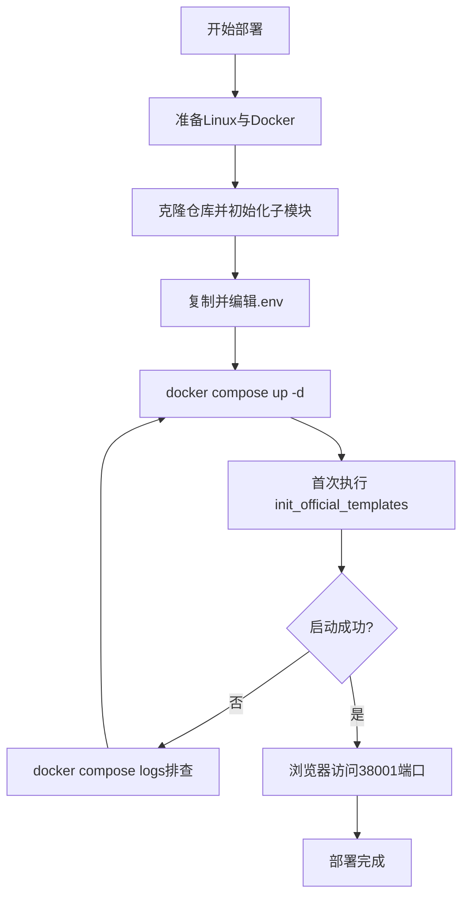

本文说明如何在自有服务器上使用 **Docker Compose** 部署 Beancount-Trans，使数据与运行环境完全由您掌控。适合熟悉 Linux 与 Docker 的读者。

<details>
<summary>Compose 架构一览</summary>

主栈使用预构建镜像 `dhr2333/beancount-trans-frontend:latest`、`dhr2333/beancount-trans-backend:latest`，由下列服务组成：

| 服务 | 镜像要点 | 作用 |
| :--- | :--- | :--- |
| `beancount-trans-frontend` | 前端 Nginx | 对外映射 **38001→80**；静态前端根路径 `/`；将 **`/admin`、`/api`** 反代至后端（与前端仓库 `conf/nginx.conf` 一致） |
| `beancount-trans-backend` | 后端 Django | 启动时执行 `migrate` 与 `docker_start.sh`；挂载 `./Beancount-Trans-Backend/Assets` 与命名卷 **collectstatic**（与前端共享 Django 静态资源） |
| `beancount-trans-worker` | 同后端镜像 | **Celery Worker**：账单解析等异步任务 |
| `beancount-trans-beat` | 同后端镜像 | **Celery Beat**：定时任务（如过期解析确认、Fava 容器清理等），调度器为 `django_celery_beat.schedulers:DatabaseScheduler` |
| `beancount-trans-postgres` | `postgres:18.3-alpine` | 数据库；宿主机 **65432→5432** |
| `beancount-trans-redis` | `redis:8.6.1-alpine` | 缓存与 Celery broker；`requirepass` 由 `.env` 中 `TRANS_REDIS_PASSWORD` 提供；**默认不映射**宿主机端口 |
| `beancount-trans-minio` | `minio/minio` | 对象存储；**39000**（S3 API）、**39001**（控制台） |
| `beancount-trans-minio-init` | `minio/mc` | 一次性初始化：创建存储桶后退出 |
| `beancount-trans-fava-admin` | `dhr2333/beancount-trans-assets:latest` | 静态 Fava 示例（`admin`）；多用户时的增删改见 **「新增用户」** |

</details>

## 先决条件

| 项目 | 要求 | 检查命令 |
| :--- | :--- | :--- |
| **操作系统** | 建议使用主流 Linux 发行版 | `cat /etc/os-release` |
| **Docker** | Docker Engine ≥ 20.10 | `docker --version` |
| **Docker Compose** | Compose 插件 v2+ | `docker compose version` |
| **硬件** | 建议 ≥ 2 核 CPU、4GB 内存、20GB 磁盘（含镜像与数据卷） | `free -h`、`df -h` |
| **网络** | 可拉取镜像；对外访问需放行端口（默认 Web **38001** 等） | — |

<details>
<summary>未安装 Docker？</summary>

请优先按 Docker 官方文档安装（不同发行版步骤不同）：
- [Docker Engine 安装](https://docs.docker.com/engine/install/)
- [Docker Compose 安装](https://docs.docker.com/compose/install/)

安装后执行：

`docker --version`

`docker compose version`
</details>

## 最短路径：启动一套可访问的环境

### 1. 获取代码与子模块

主仓库通过子模块挂载后端资源目录（Compose 中的 `./Beancount-Trans-Backend/Assets`）。**至少**初始化后端子模块，否则宿主机目录不完整：

```shell
git clone https://github.com/dhr2333/Beancount-Trans.git
cd Beancount-Trans
git submodule update --init Beancount-Trans-Backend
```

若您需要完整开发目录，可改为：

```shell
git submodule update --init --recursive
```

### 2. 准备环境变量文件

Compose 使用根目录下的 `.env`：

```shell
cp .env.example .env
```

自托管部署可暂用示例值，但建议继续阅读 [「生产与安全」](/docs/developer/self-host#生产与安全) 章节，修改密钥与访问控制。

### 3. 启动服务

在仓库根目录（存在 `docker-compose.yaml` 的目录）执行：

```shell
docker compose up  # 添加 -d 参数后台运行
```

首次启动会拉取镜像并创建命名数据卷（PostgreSQL、Redis、MinIO 等），**数据默认持久保存在 Docker 卷中**。

### 4. 初始化

请在**首次部署**（或 `docker compose down -v` 清库后）手动初始化：

```shell
docker compose exec beancount-trans-backend python manage.py init_official_templates
```

> 若执行 `docker compose down -v` 会删除卷内数据，请谨慎使用 `-v`。

### 5. 访问

将 `your-server-ip` 换为服务器 IP 或域名：

- **Web 应用**：`http://your-server-ip:38001`
- **后台管理**：`http://your-server-ip:38001/admin`
- **API 文档**：`http://your-server-ip:38001/api/docs`

默认登录账户：用户名 `admin`，密码 `123456`（生产环境首次登录后建议立即修改密码）。

## 生产与安全

### 修改 `.env` 中的敏感项

务必替换或强化至少以下项。完整 **环境变量** 见 [参考](./reference)。

- `DJANGO_SECRET_KEY`：随机长字符串（示例中有生成命令）。
- `DJANGO_DEBUG=False`：关闭调试；并按注释配置 `DJANGO_ALLOWED_HOSTS`、`CSRF_TRUSTED_ORIGINS`、`CORS_ALLOWED_ORIGINS`，以便从域名或其它设备访问。
- `TRANS_POSTGRESQL_PASSWORD`、`TRANS_REDIS_PASSWORD`、`MINIO_ACCESS_KEY`、`MINIO_SECRET_KEY`：不要使用默认弱口令。

### 自托管无短信时的登录策略

`.env.example` 建议：将 `PHONE_BINDING_REQUIRED=False`、`SMS_ENABLED=False`，以便使用用户名/邮箱与密码登录；验证码邮件可配置 SMTP，不配置时验证码会输出到后端日志（见 `.env.example` 中邮箱一节）。

### 数据保存在哪里

- **数据库 / Redis / MinIO**：由 Compose 中定义的 **命名卷** 持久化（卷名以 `beancount-trans-` 为前缀，见 `docker-compose.yaml` 底部 `volumes`）。
- **用户解析产物与账本文件**：宿主机目录 `./Beancount-Trans-Backend/Assets`（与容器内 Django 资源路径一致），**请纳入备份策略**。

## 新增用户

自托管默认只有 **`admin`**。需多人共用时，在 **Django 管理后台** 创建普通用户即可：

1. 浏览器打开 `http://your-server-ip:38001/admin`，使用 `admin` 或您已有的超级用户登录。
2. 进入 **用户（Users）** → **增加用户**，设置用户名与密码。

若需要**再增加一名超级用户**（可登录 `/admin`），可在宿主机执行：

```shell
docker compose exec beancount-trans-backend python manage.py createsuperuser
```

新用户若要在平台内打开 **Fava 账本报表**，在**建户后**还须完成下面几步：

1. **编辑 `docker-compose.yaml`**：复制现有 Fava 服务块（可参考 `beancount-trans-fava-admin`），将 `admin` 改为新用户的用户名，并修改 **`container_name`、`ports`、`volumes`**，使挂载为 `./Beancount-Trans-Backend/Assets/<用户名>:/Assets`。
2. **编辑 `.env`**：在 **`FAVA_STATIC_USER_MAP`** 中增加一项，**键**与后端解析一致（一般为 **用户名**；存在 Git 时也可能用 **`repo_name`**），**值**为浏览器能打开的完整 URL（如 `http://宿主机IP:5002`）。

## 常用运维命令

```shell
# 停止（不删除卷）
docker compose down

# 后台启动
docker compose up -d

# 首次部署（或 down -v 后）手动初始化
docker compose exec beancount-trans-backend python manage.py init_official_templates

# 重启某一服务
docker compose restart beancount-trans-backend

# 查看日志
docker compose logs -f
docker compose logs -f beancount-trans-backend
```

## 故障排除

**容器反复重启或无法连接数据库**  
查看后端与数据库日志：`docker compose logs beancount-trans-backend`。常见原因包括 `.env` 中数据库主机名/密码与 Postgres 服务不一致、卷权限异常等。

**复用自有 PostgreSQL**  

1. 在自有实例上创建 `beancount-trans` 空库。  
2. `.env`：`TRANS_POSTGRESQL_HOST`、`TRANS_POSTGRESQL_PORT`、`TRANS_POSTGRESQL_DATABASE`、`TRANS_POSTGRESQL_USER`、`TRANS_POSTGRESQL_PASSWORD` 指向该实例（`HOST` 须为**容器内可解析且可连通**的地址）。  
3. `docker-compose.yaml`：删除或注释 **`beancount-trans-postgres`**；在 **`beancount-trans-backend`**、`beancount-trans-worker`、`beancount-trans-beat` 上移除对 **`beancount-trans-postgres`** 的 **`depends_on`**。  
4. `docker compose up -d` 重启栈；首次启动仍会执行 `migrate` 建表。

## 部署流程一览



## 下一步

- **HTTP API（线上）**：[Beancount-Trans API](https://trans.dhr2333.cn/api/docs/)；自托管：`http://<主机>:38001/api/docs/`（端口随映射而定）。
- **源码与问题反馈**：[Beancount-Trans](https://github.com/dhr2333/Beancount-Trans) 主仓库及 [Issues](https://github.com/dhr2333/Beancount-Trans/issues)。
- **环境变量说明**：请参考 [参考](./reference) 章节。
