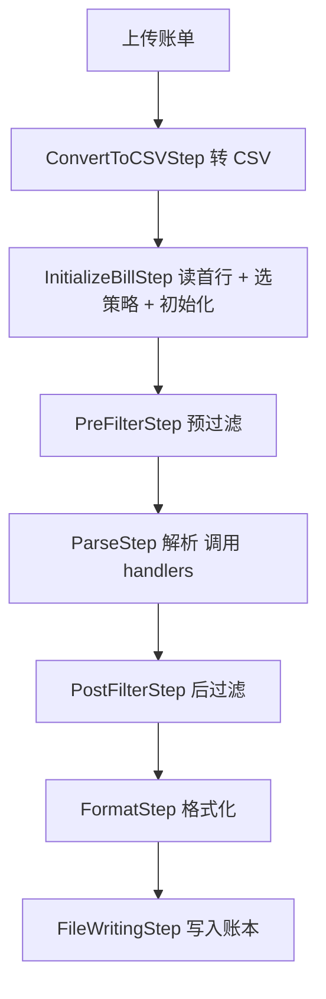

本文面向开发者，说明如何为 Beancount-Trans 新增一种**数据源**（账单来源），例如某家银行的借记卡、信用卡，或一个新的支付平台。按本文步骤操作，即可让系统自动识别并解析该来源的账单。

## 一、适用场景与前提

「新增数据源」= 新增一种账单来源，判定维度通常是「平台或银行 + 卡种」，例如「中国建设银行储蓄卡」。每一种来源在后端对应一个独立的 `bill_identifier` 标识与一组专属解析逻辑。

开始之前，请确认具备以下条件：

- 能获取该来源**真实导出**的账单样本（支持 `csv`、`xls`、`xlsx`、`pdf`，`zip` 会自动解压取内层文件）。
- 本地能跑起后端，并能执行 `pytest`。
- 已阅读仓库约束：[账单模块边界规则](https://github.com/dhr2333/Beancount-Trans-Backend/blob/main/.cursor/rules/11-translate-bill-module-boundary.mdc)。

**最短路径**：以结构最简单的银行借记卡实现 [CCB_Debit.py](https://github.com/dhr2333/Beancount-Trans-Backend/blob/main/project/apps/translate/views/CCB_Debit.py) 为起点，它同时提供了「初始化策略 + 业务逻辑」的最小可用范式。

## 二、总览：一次改动涉及哪些文件

以下路径均相对后端仓库 `Beancount-Trans-Backend/`。

| # | 文件 | 是否必须 | 职责 |
| :-- | :-- | :-- | :-- |
| 1 | `project/apps/translate/utils.py` | 是 | 新增 `BILL_XXX = "xxx"` 常量；银行类还需在 `get_card_number()` 中加分支 |
| 2 | `project/apps/translate/services/init/strategies/xxx_init_strategy.py` | 是 | 新建 `InitStrategy` 子类，把原始行转换为统一字段字典列表 |
| 3 | `project/apps/translate/services/init/bill_init_factory.py` | 是 | 导入并 `InitFactory.register_strategy(...)` |
| 4 | `project/apps/translate/views/XXX.py` | 是 | 该来源专属的字段提取与账户判定函数 |
| 5 | `project/apps/translate/services/handlers.py` | 是 | 8 个分发字典 + `AccountHandler` / `ExpenseHandler` / `PayeeHandler` 的薄分支 |
| 6 | `project/apps/translate/services/parse/ignore_rules/xxx_rule.py` 与 `services/parse/__init__.py` | 否 | 预过滤 / 后过滤忽略规则 |
| 7 | `project/utils/file.py` | 视来源 | 非 CSV（`xls`/`xlsx`/`pdf`）需在 `handle_excel()` / `handle_pdf()` 中加识别与转换分支 |
| 8 | `Beancount-Trans-Docs/docs/02-操作指南/账单导出方法.md` | 是 | 在「支持以下账单」中补充该来源的导出方法（面向用户） |
| 9 | `Beancount-Trans-Frontend/src/components/trans/Trans.vue` | 是 | 更新「当前支持……」文案（前端为独立子模块仓库） |
| 10 | `project/fixtures/sample_files/` 与 `project/apps/translate/tests/` | 建议 | 案例账单与初始化策略回归用例 |

后端解析管线（[services/steps.py](https://github.com/dhr2333/Beancount-Trans-Backend/blob/main/project/apps/translate/services/steps.py)）如下，你需要为新增来源"喂"的正是**步骤 2 的识别特征**与**步骤 3 的统一字段**：



步骤 `InitializeBillStep` 会读取文件首行，交给 `InitFactory.create_strategy(first_line)` 选出策略，再调用 `strategy.init(csv_file, card_number=..., year=...)`。

`views/AAA_Template.py` 已列出所有需要实现的函数签名，可直接以它为起点。

## 三、逐步实现

### 1. 定义账单标识常量

在 [utils.py](https://github.com/dhr2333/Beancount-Trans-Backend/blob/main/project/apps/translate/utils.py) 顶部的 `BILL_*` 常量区新增一行：

```python
BILL_XXX = "xxx"
```

该字符串会写入每条解析记录的 `bill_identifier` 字段，贯穿整条管线，用于在各处分流调用不同来源的逻辑。

若该来源是**银行类**账单，还需要在 [utils.py](https://github.com/dhr2333/Beancount-Trans-Backend/blob/main/project/apps/translate/utils.py) 的 `get_card_number()` 中增加一个分支，用 `SOURCE_FILE_IDENTIFIER` 判定并调用你实现的取卡号函数。

### 2. 编写初始化策略

在 `project/apps/translate/services/init/strategies/` 下新建 `xxx_init_strategy.py`，继承 [InitStrategy](https://github.com/dhr2333/Beancount-Trans-Backend/blob/main/project/apps/translate/services/init/strategies/base_bill_init_strategy.py)：

```python
from project.apps.translate.services.init.strategies.base_bill_init_strategy import InitStrategy
from project.apps.translate.utils import BILL_XXX
from typing import List, Dict, Any
import csv
import logging


class XXXInitStrategy(InitStrategy):
    """XXX 账单初始化策略"""

    # 能唯一标识该账单类型的首行特征串（用于 identifier 识别）
    HEADER_MARKER = "XXX 账单明细"
    # 能唯一标识该账单类型的原始上传文件特征串（可用于取卡号）
    SOURCE_FILE_IDENTIFIER = "XXX 个人活期账户全部交易明细"

    def init(self, bill: Any, **kwargs) -> List[Dict[str, Any]]:
        # 若上游已 readline 读取过首行，这里需回到文件开头
        if hasattr(bill, "seek"):
            bill.seek(0)

        csv_reader = csv.reader(bill)
        records = []
        try:
            for row in csv_reader:
                record = {
                    'transaction_time': '',      # 格式：YYYY-MM-DD HH:MM:SS
                    'transaction_category': '',  # 交易类型 / 摘要
                    'counterparty': '',          # 交易对方
                    'commodity': '',             # 商品描述（映射关键字在此字段中匹配）
                    'transaction_type': '',      # 收入 / 支出 / 不计收支 / /
                    'amount': '',                # 金额（正数，float 或数字字符串）
                    'payment_method': '',        # 支付方式（用于资产映射 key 匹配）
                    'transaction_status': '',    # 交易状态
                    'notes': '',                 # 备注
                    'bill_identifier': BILL_XXX, # 与 utils.py 中的常量一致
                    'uuid': '',                  # 唯一标识（无则留空，管线会生成哈希）
                }
                records.append(record)
        except UnicodeDecodeError as e:
            logging.error("Unicode decode error at row=%s: %s", row, e)
        except Exception as e:
            logging.error("Unexpected error: %s", e)

        return records

    @classmethod
    def identifier(cls, first_line: str) -> bool:
        return cls.HEADER_MARKER in first_line
```

**关键**：`identifier()` 决定系统如何自动识别这种账单，它只检查文件首行是否包含特征文本；银行类可从 `kwargs` 里取到 `card_number` / `year`。字段含义见「四、记录字段契约」。

### 3. 注册到工厂

在 [bill_init_factory.py](https://github.com/dhr2333/Beancount-Trans-Backend/blob/main/project/apps/translate/services/init/bill_init_factory.py) 顶部导入策略类，并在文件末尾注册：

```python
from project.apps.translate.services.init.strategies.xxx_init_strategy import XXXInitStrategy

InitFactory.register_strategy(XXXInitStrategy)
```

注册后，上传文件时会按注册顺序尝试匹配 `identifier()`，命中即使用该策略。

### 4. 实现账单业务逻辑（views/XXX.py）

在 `project/apps/translate/views/` 下新建 `XXX.py`，实现该来源专属的字段提取与账户判定函数。参考 [AAA_Template.py](https://github.com/dhr2333/Beancount-Trans-Backend/blob/main/project/apps/translate/views/AAA_Template.py) 的函数签名：

- `xxx_get_uuid(data)`：返回唯一标识（有交易单号直接返回，无则留空由管线生成）
- `xxx_get_status(data)`：返回条目状态字符串
- `xxx_get_note(data)`：返回备注
- `xxx_get_amount(data)`：返回格式化金额（如 `"123.45"`）
- `xxx_get_tag(data)` / `xxx_get_commission(data)` / `xxx_get_discount(data)`：标签、手续费、折扣（按需）
- `xxx_init_key(data)`：返回资产映射匹配键（如 `"XX银行储蓄卡(1234)"`）
- `xxx_get_type(data)`：交易类型（支付宝 / 微信类需要）
- `xxx_get_account` 及收入 / 支出 / 余额变体：根据资产映射确定资产账户
- 银行类另有 `xxx_get_balance(data)`（余额）与 `xxx_get_card_number(content)`（取卡号）

该来源的字段语义、拼接匹配文本、收支与账户判定规则**都集中写在这个文件里**，并以无状态函数对外暴露，由 `handlers.py` 调用（见 [模块边界规则](https://github.com/dhr2333/Beancount-Trans-Backend/blob/main/.cursor/rules/11-translate-bill-module-boundary.mdc)）。

### 5. 接入 handlers.py

在 [handlers.py](https://github.com/dhr2333/Beancount-Trans-Backend/blob/main/project/apps/translate/services/handlers.py) 中为新来源补上分支调用。**只做薄分支**，具体逻辑仍在 `views/XXX.py`。

模块级分发字典（按需在各字典中新增一项）：

- `get_uuid(data)`
- `get_status(data)`
- `get_note(data)`
- `get_amount(data)`
- `get_tag(data)`
- `get_balance(data)`
- `get_commission(data)`
- `get_discount(data)`
- `get_shouzhi(data)`：收 / 支符号判定，有特殊规则时增加分支

Handler 内部（按需增加 `elif self.bill == BILL_XXX:` 分支）：

- `AccountHandler.initialize_key()`：初始化资产映射匹配键
- `AccountHandler.initialize_type()`：初始化交易类型
- `AccountHandler.get_account()`：确定资产账户
- `ExpenseHandler.initialize_type()`
- `ExpenseHandler.get_expense()`：支出 / 收入分类（含 `_process_expense` / `_process_income` 的特殊匹配）
- `PayeeHandler.get_payee()`：收 / 付款人特殊规则

### 6. 添加忽略规则（可选）

若该来源有需要自动过滤的交易状态，在 `project/apps/translate/services/parse/ignore_rules/` 下新建规则文件：

```python
from project.apps.translate.services.parse.ignore_registry import registry
from project.apps.translate.utils import BILL_XXX
from typing import Dict


def xxx_pre_filter(row: Dict, args: Dict) -> bool:
    """返回 True 表示忽略该条记录"""
    return row['transaction_status'] in ["交易关闭", "已撤销"]


registry.register_pre_filter(BILL_XXX, xxx_pre_filter)
```

并在 [services/parse/__init__.py](https://github.com/dhr2333/Beancount-Trans-Backend/blob/main/project/apps/translate/services/parse/__init__.py) 中导入该模块，以触发注册。参考 [alipay_rule.py](https://github.com/dhr2333/Beancount-Trans-Backend/blob/main/project/apps/translate/services/parse/ignore_rules/alipay_rule.py)。

### 7. 非 CSV 来源：Excel / PDF / ZIP

若账单是 `xls` / `xlsx` / `pdf`，转换分发在 [project/utils/file.py](https://github.com/dhr2333/Beancount-Trans-Backend/blob/main/project/utils/file.py)：

- `handle_excel(file)`：`xls` / `xlsx` 的识别与 DataFrame → CSV 转换
- `handle_pdf(file, password)`：按提取文本特征识别账单类型并转换（PDF 解密、ZIP 解压已由该模块统一处理）

在其中增加该来源的识别与转换分支即可；`SUPPORTED_EXTENSIONS` 已包含 `csv` / `xls` / `xlsx` / `pdf` / `zip`，无需修改。PDF 转换可参考 `cmb_credit_pdf_convert_to_csv`、`boc_debit_pdf_convert_to_string` 的实现方式。

### 8. 同步用户文档、前端与案例 / 测试

- **用户文档**：更新《账单导出方法》（`docs/02-操作指南/账单导出方法.md`），在「支持以下账单」下新增该来源的小节，说明用户如何导出该账单；线上页面见 [bills-export-methods](https://trans.dhr2333.cn/docs/%E6%93%8D%E4%BD%9C%E6%8C%87%E5%8D%97/bills-export-methods)。
- **前端支持列表**：更新 [Trans.vue](https://github.com/dhr2333/Beancount-Trans-Frontend/blob/main/src/components/trans/Trans.vue) 中「当前支持……账单」的文案，补上新来源（前端为独立子模块仓库，需单独提交）。
- **案例账单**：把脱敏后的样本放入 `project/fixtures/sample_files/`，要求见 [fixtures/README.md](https://github.com/dhr2333/Beancount-Trans-Backend/blob/main/project/fixtures/README.md)。
- **回归用例**：在 `project/apps/translate/tests/` 下新增初始化策略用例，参考 [test_alipay_init_strategy.py](https://github.com/dhr2333/Beancount-Trans-Backend/blob/main/project/apps/translate/tests/test_alipay_init_strategy.py)。

## 四、记录字段契约

初始化阶段必须为每一条记录产出以下字段，这是后续管线（过滤、解析、格式化）的契约：

| 字段 | 类型 | 说明 |
| :-- | :-- | :-- |
| `transaction_time` | `str` | `YYYY-MM-DD HH:MM:SS` 格式 |
| `transaction_category` | `str` | 交易分类 / 摘要 |
| `counterparty` | `str` | 交易对方名称 |
| `commodity` | `str` | 商品描述（映射关键字会在此字段中匹配） |
| `transaction_type` | `str` | `收入` / `支出` / `/` / `不计收支` |
| `amount` | `float` / `str` | 金额（正数） |
| `payment_method` | `str` | 支付渠道（用于资产映射的 `key` 匹配） |
| `transaction_status` | `str` | 原始交易状态 |
| `notes` | `str` | 备注信息 |
| `bill_identifier` | `str` | 账单类型标识常量 |
| `uuid` | `str` | 交易唯一标识（可为空，为空时管线按整行内容生成哈希） |

银行类账单可额外包含：`balance`（余额）、`card_number`（对方卡号）、`counterparty_bank`（对方银行开户行）。

## 五、验证清单

1. 上传该来源的**真实样本**，确认 `identifier()` 命中、初始化字段符合上表契约。
2. 跑通完整解析流程，检查映射匹配与 Beancount 文本输出是否正确。
3. 在**后端根目录**执行 `pytest`，确保未破坏既有来源。
4. 重点回归微信 / 支付宝基线：`完整测试_微信.csv`、`完整测试_支付宝.csv` 必须仍可解析，遵守 [兼容性规则](https://github.com/dhr2333/Beancount-Trans-Backend/blob/main/.cursor/rules/10-translate-wechat-alipay-bill-compat.mdc)。

## 六、参考实现对照

| 账单类型 | 初始化策略 | 业务逻辑 | 忽略规则 |
| :-- | :-- | :-- | :-- |
| 支付宝 | [alipay_init_strategy.py](https://github.com/dhr2333/Beancount-Trans-Backend/blob/main/project/apps/translate/services/init/strategies/alipay_init_strategy.py) | [AliPay.py](https://github.com/dhr2333/Beancount-Trans-Backend/blob/main/project/apps/translate/views/AliPay.py) | [alipay_rule.py](https://github.com/dhr2333/Beancount-Trans-Backend/blob/main/project/apps/translate/services/parse/ignore_rules/alipay_rule.py) |
| 微信 | [wechat_init_strategy.py](https://github.com/dhr2333/Beancount-Trans-Backend/blob/main/project/apps/translate/services/init/strategies/wechat_init_strategy.py) | [WeChat.py](https://github.com/dhr2333/Beancount-Trans-Backend/blob/main/project/apps/translate/views/WeChat.py) | [wechat_rule.py](https://github.com/dhr2333/Beancount-Trans-Backend/blob/main/project/apps/translate/services/parse/ignore_rules/wechat_rule.py) |
| 中国银行借记卡 | [boc_debit_init_strategy.py](https://github.com/dhr2333/Beancount-Trans-Backend/blob/main/project/apps/translate/services/init/strategies/boc_debit_init_strategy.py) | [BOC_Debit.py](https://github.com/dhr2333/Beancount-Trans-Backend/blob/main/project/apps/translate/views/BOC_Debit.py) | [boc_debit_rule.py](https://github.com/dhr2333/Beancount-Trans-Backend/blob/main/project/apps/translate/services/parse/ignore_rules/boc_debit_rule.py) |
| 招商银行信用卡 | [cmb_credit_init_strategy.py](https://github.com/dhr2333/Beancount-Trans-Backend/blob/main/project/apps/translate/services/init/strategies/cmb_credit_init_strategy.py) | [CMB_Credit.py](https://github.com/dhr2333/Beancount-Trans-Backend/blob/main/project/apps/translate/views/CMB_Credit.py) | [cmb_credit_rule.py](https://github.com/dhr2333/Beancount-Trans-Backend/blob/main/project/apps/translate/services/parse/ignore_rules/cmb_credit_rule.py) |
| 工商银行借记卡 | [icbc_debit_init_strategy.py](https://github.com/dhr2333/Beancount-Trans-Backend/blob/main/project/apps/translate/services/init/strategies/icbc_debit_init_strategy.py) | [ICBC_Debit.py](https://github.com/dhr2333/Beancount-Trans-Backend/blob/main/project/apps/translate/views/ICBC_Debit.py) | — |
| 建设银行借记卡 | [ccb_debit_init_strategy.py](https://github.com/dhr2333/Beancount-Trans-Backend/blob/main/project/apps/translate/services/init/strategies/ccb_debit_init_strategy.py) | [CCB_Debit.py](https://github.com/dhr2333/Beancount-Trans-Backend/blob/main/project/apps/translate/views/CCB_Debit.py) | — |

## 相关文档

- 开发者参考（环境变量、HTTP API、术语）：[参考](https://trans.dhr2333.cn/docs/developer/reference)
- 自托管部署：[自托管](https://trans.dhr2333.cn/docs/developer/self-host)
- 源码与问题反馈：[Beancount-Trans 主仓库](https://github.com/dhr2333/Beancount-Trans) · [Issues](https://github.com/dhr2333/Beancount-Trans/issues)
