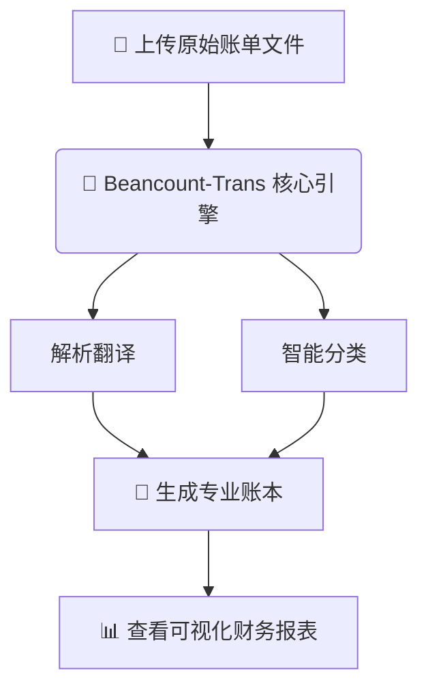

欢迎来到 Beancount-Trans！在开始使用之前，花几分钟了解以下几个核心概念，将会让您的使用体验更加顺畅。我们承诺，即使您没有任何技术或会计背景，也能轻松看懂。

## 一、总览：它是如何工作的？

想象一下，您只需做一步：**上传您在支付宝、微信或银行下载的账单文件**。

剩下的繁琐工作，Beancount-Trans 会为您自动完成：

1. **解析翻译**：将账单上的 " 购物 "、" 转账 " 等流水记录，翻译成专业记账软件能懂的语言。
2. **智能分类**：自动判断一笔消费是 " 餐饮外卖 " 还是 " 交通出行 "。
3. **生成报表**：将这些记录整理到一个 " 超级记账本 " 中，并为您生成一目了然的饼图、趋势图等可视化报表。

整个过程如下图所示：

## 二、核心概念详解

### 1. 账本 (Ledger) - 您的 " 超级记账本 "

- **它是什么？** 这是您所有财务记录的**总仓库**，也是一个后缀名为 `.bean` 的文本文件。您在这个平台上的所有操作，最终都是为了丰富和完善这个账本。
- **简单理解：** 它就好比您以前用的那个纸质记账本，但更强大、更智能。您不需要直接编辑它，平台会替您管理。
- **有什么用？** 所有漂亮的图表和报表，都是从这个 " 超级记账本 " 里自动生成的。

### 2. 解析 (Parsing) - " 翻译官 "

- **它是什么？** 是平台将您上传的**原始账单文件**（CSV/Excel）转换成**账本能读懂的语言**的过程。
- **简单理解：** 您的支付宝账单就像一份 " 英文材料 "，而账本只懂 " 中文 "。**解析**就是一个专业的 " 翻译官 "，负责把内容准确翻译过来。
- **您需要做什么？** 您只需要点击 " 解析 " 按钮，剩下的交给 " 翻译官 "。

### 3. 映射 (Mapping) - " 翻译官的词典 "

- **它是什么？** 一组规则，是**解析**这个 " 翻译官 " 所使用的**词典**。
- **为什么需要它？**
  - 例子：账单中 " 深圳市腾讯计算机系统有限公司 " 可能是在您充值游戏，而 " 腾讯云计算（北京）有限责任公司 " 可能是您购买服务器
  - **映射规则**可以告诉系统，前者归为 `Expenses:Game`（娱乐: 游戏）账户，后者归为 `Expenses:Work:Server`（工作: 服务器费用）账户。
  - 平台已经为您预装了一本非常庞大的 " 常用词典 "（默认映射规则），能自动识别绝大多数常见消费。
- **您需要做什么？**
  - **大多数情况：** 您什么都不用做，系统会自动匹配。
  - **发现分类错误时：** 您可以自己来教 " 翻译官 " 一个新词。只需创建一条新规则：" 当看到 'XX 超市 ' 时，请把它归到 `Expenses:Shopping:Daily`（购物: 日用百货）账户 "。创建一次，以后所有同类消费都会自动正确分类。

### 4. 账户 (Account) - 您的 " 财务分类箱 "

- **它是什么？** 账户是您账本中的**基本分类单位**，记录每一笔资金的来源和去向。
- **账户与映射的关系：**
  - **账户是目的地**：`Expenses:Food`（餐饮）、`Assets:Alipay`（支付宝）
  - **映射是导航**：告诉系统 " 看到 ' 餐饮 ' 关键词 → 去往 `Expenses:Food` 账户 "
- **您需要做什么？**
  - **大多数情况**：系统已预置常用账户，您什么都不用做
  - **新增分类**：想记录 " 宠物支出 "？只需：
    1. 定义新账户 `Expenses:Pets`
    2. 创建映射：" 看到 ' 宠物医院 ' → 去往 `Expenses:Pets`"
  - **一次设置，永久生效**：创建后，所有同类消费自动分类

### 5. Fava - " 报表大师 "

- **它是什么？** 一个非常强大的开源报表工具。它是 Beancount 的 " 最佳搭档 "。
- **简单理解：** 如果**账本**是存储了所有数据的 " 数据库 "，那么 **Fava** 就是一个能读取这个数据库并生成各种精美图表的 " 报表软件 " 或 " 数据可视化工具 "。
- **您需要做什么？** 您只需要在平台上点击 " 查看平台账本 " 或类似按钮，系统就会自动启动 Fava 并为您展示所有财务报表。您只需享受查看结果的乐趣。

| 概念               | 角色比喻       | 功能             | 用户操作                  |
| :--------------- | :--------- | :------------- | :-------------------- |
| **账本 (Ledger)**  | **超级记账本**  | 存储所有财务交易记录     | 由平台自动维护，无需直接操作        |
| **解析 (Parsing)** | **翻译官**    | 将原始账单转换为专业账本语言 | 点击一下 " 解析 " 按钮        |
| **账户 (Account)** | **财务分类箱**  | 资金的具体分类位置      | 大部分时间无需操作，分类不满足时添加账户  |
| **映射 (Mapping)** | **翻译官的词典** | 定义账单关键词如何对应到账户 | 大部分时间无需操作，发现错误时来添加新规则 |
| **Fava**         | **报表大师**   | 将账本数据可视化为图表和报表 | 点击 " 查看报表 " 按钮即可      |

---

**下一步建议：**

现在您已经了解了核心概念，可以开始您的旅程了！

- **👉 [快速入门](https://trans.dhr2333.cn/docs/quick-start)：** 如果您想立刻体验，请按照快速入门指南，5 分钟内看到您的第一份财务报表！
- **👉 [账单文件要求](https://trans.dhr2333.cn/docs/blog/2024/08/22/%E8%B4%A6%E5%8D%95%E5%AF%BC%E5%87%BA%E5%8F%8A%E6%9F%A5%E7%9C%8B%E6%96%B9%E6%B3%95)：** 如果您想了解如何从支付宝、微信导出账单文件，请阅读这篇指南。
