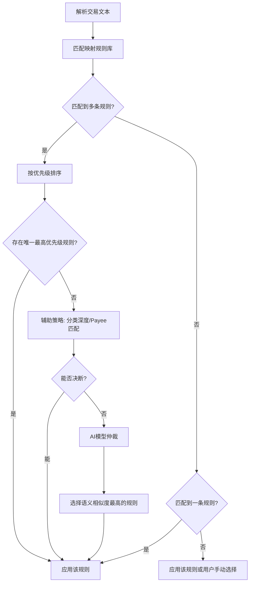

映射是 Beancount-Trans 平台智能化的心脏。它让系统学会如何理解您的每一条消费记录，并将其归入正确的类别。本章将详细介绍映射的工作原理和使用方法。

## 一、什么是映射？为什么需要它？

### 1. 一个生动的比喻

想象一下，您是一位世界级的翻译官，但您需要一本**词典**。

- **原始账单**就像是用各种方言和缩写写成的外文。
- **映射规则**就是您的**词典**，它明确地定义了：" 当看到 'A 词 ' 时，就翻译成 'B 类 '"。
- 没有这本词典，翻译官就无法工作；有一本好词典，翻译工作就能又快又准。

### 2. 为什么需要映射？

因为同一个商家，在不同的账单上可能有不同的名称。
例如，您在 " 麦当劳 " 吃饭，账单上可能显示为：

- `麦当劳（人民广场店）`
- `McDonald's RMBGC`
- `上海麦当劳食品有限公司`

如果没有映射，系统会认为这是三个不同的商家。而通过一条映射规则，您可以告诉系统：**所有包含 " 麦当劳 " 或 "McDonald" 字样的交易，都归为 `Expenses:Food:Restaurant`（餐饮: 外出就餐）**。

## 二、映射的三种类型

- 支出映射：**最常见**的类型，用于分类您的消费。例如：`麦当劳` -> `Expenses:Food:Restaurant`
- 收入映射：用于分类您的收入来源。例如：`某某科技有限公司` ->`Income:Salary`
- 资产映射：用于不同资产账户之间的转账记录。例如：`余额宝` -> `Assets:Savings:Web:AliFund`

## 三、映射规则详解：一条规则长什么样？

一条映射规则主要由以下几个部分组成，它们共同决定了规则的行为：

| 字段名                       | 说明                                                      | 示例                         | 必填  |
| :------------------------ | :------------------------------------------------------ | :------------------------- | :-- |
| **关键字 (Keyword)**         | 系统在账单的 " 交易说明 " 或 " 对方 " 等字段中寻找的文字。支持模糊匹配。              | `McDonald`                 | 是   |
| **商家 (Payee)**            | 即使关键字不同，最终写入的账本中的商家字段                                   | `麦当劳`                      | 否   |
| **映射账户 (Target Account)** | 匹配成功后，该交易应该被归类到的**会计科目**。                               | `Expenses:Food:Restaurant` | 是   |
| **货币 (Currency)**         | 通常留空即可（默认为 CNY）。仅在处理**外币交易**或**虚拟货币**（如游戏点券、平台积分）时才需要填写。 | `COIN`                     | 否   |
| 隐藏字段：**优先级（Priority）**    | 当一条交易同时匹配多条规则时，数字**大**的规则生效，受 " 商家 " 和 " 映射账户 " 影响。     |                            | 否   |

### 关键概念解释

- **关键字模糊匹配**：您不需要输入完整的名称。输入 `腾讯` 可以匹配到 `深圳市腾讯计算机系统有限公司` 和 `腾讯云`。
- **优先级**：这是解决规则冲突的关键。例如，您可以有一条通用规则：
  - 规则 A：关键字 `华为` 商家 `华为` -> `Expenses:Shopping` (优先级: 150)
  - 规则 B：关键字 `软件` 无商家 -> `Expenses:Culture` (优先级: 100)
  - 规则 C：关键字 `华为软件技术有限公司` 商家 `华为` -> `Expenses:Culture:Subscription` (优先级: 250)

> **💡 提示**：优先级会根据规则的商家和映射账户的细化程度**自动计算**，您通常无需手动管理

## 四、如何创建和管理映射？

### 创建一条新映射

1. **进入页面**：导航到【映射管理】页面，选择要创建映射的类别。

2. **点击按钮**：点击【新增】或【导入】按钮。
3. **填写表单**：
    - 在 " 关键字 " 栏输入您想匹配的名称（如 `McDonald`）。
    - （可选）在 " 商家 " 栏输入该映射所属的商家（如 `麦当劳`）
    - 在 " 映射账户 " 栏，您可以直接输入，或从下拉列表中选择一个分类（如 `Expenses:Food:Coffee`）。
    - （可选）设置 " 货币 "（一般情况下保持默认的 `CNY` 即可，遇到充值类目时可选择 `COIN`）。

4. **保存**：点击【新增】。

> **💡 提示**：系统预置了大量常用规则（默认映射），建议您先上传账单解析，只有在发现分类错误时，再来创建新的映射规则。

> [!NOTE] （高级功能预告：我们正在开发 AI 智能推荐功能，未来在上传账单时，系统将自动为您推荐分类，并一键创建映射规则，敬请期待！）
>
> ### AI 智能推荐：更轻松的方式
>
> 当您上传账单进行解析时，我们的 AI 引擎会自动分析那些**未被现有规则匹配**的交易，并为您推荐可能的目标账户。
>
> 1. 在解析结果页面，查看 " 状态 " 为 " 待确认 " 或 " 推荐 " 的交易。
> 2. AI 会在 " 推荐账户 " 列给出 1-N 个可能选项。
> 3. **您只需要从下拉菜单中选择最正确的那个**。
> 4. 选择后，系统会自动为您**创建一条新的映射规则**，并且本条交易也会立即被重新分类。
>
> **这个过程是学习映射规则最快捷、最无痛的方式！**

## 五、映射的流程与优先级

下图清晰地展示了一条交易从被解析到最终被分类的完整决策过程，以及优先级如何在其中起作用：

## 六、最佳实践与高级技巧

1. **从宽到窄**：先创建通用规则（如 `麦当劳`），再根据需要创建特殊规则（如 `麦当劳-小程序早餐` -> `Expenses:Food:Breakfast`），通过 " 商家 " 和 " 映射账户 " 中的 ":" 数量赋予更高优先级。
2. **善用标签**：在付款时给需要报销的餐饮打上 `#Business` 标签，以后在报表中可以轻松筛选出所有商务宴请的费用。
3. **定期审核**：偶尔检查一下映射规则列表，清理那些过时或重复的规则，保持 " 词典 " 的整洁高效。
4. **使用生效日期**：对于双十一、年度会员费等周期性消费，可以设置规则是否生效，避免其他时间误匹配。

## 七、常见问题 (FAQ)

**Q1: 我创建了一条新规则，为什么旧的账单数据没有自动变更？**
**A:** 映射规则是在**解析账单时**应用的。对于已解析的数据，您需要重新解析原账单文件，新规则才会生效。

**Q2: 如何测试一条规则是否有效？**
**A:** 您可以在【解析】页面，上传一个包含目标关键词的小额测试账单文件，查看解析结果是否符合预期。

**Q3: 一条交易同时匹配了多条规则，且优先级相同，会怎样？**
**A:** 系统会根据【[格式化输出](https://trans.dhr2333.cn/format)】中所选的 AI 模型（BERT、spaCy 或 DeepSeek）对该交易进行语义相似度计算，选择分数最高的条目。因此，您无需担心因优先级相同而导致错误分类，系统会为您做出一个智能且合理的选择。

**Q4: 关键字是否区分大小写？**
**A:** 不区分。`apple`、`Apple`、`APPLE` 的效果是一样的。

**Q5: 我可以导入/导出映射规则吗？**
**A:** 可以。在【映射管理】页面，点击【导出】按钮即可将您的规则备份为 CSV 文件。同样地，点击【导入】可以选择一个 CSV 文件来批量添加规则。

---

**下一步：**

- 现在您已经理解了映射，可以去【[解析](https://trans.dhr2333.cn/trans)】页面实际上传一份账单，体验 AI 推荐和创建映射的过程了！
- 如果您在创建规则时对分类感到困惑，可以参考我们的 [会计科目建议](https://trans.dhr2333.cn/map/templates)。
