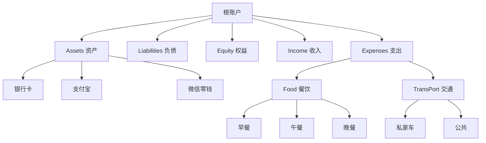

每当账单被解析成 Beancount 语句，平台都会问一句：" 这一笔该放到哪个抽屉？" 答案，就是账户。理解账户并不需要会计背景，它更像是整理收纳：把散落在桌面的东西放回盒子，家里自然井井有条。

## 一、账户的核心作用

账户在 Beancount-Trans 中承担着关键角色：

- **定义资金流向**：明确记录 " 钱从哪里来，花到哪里去 "
- **结构化分类**：提供清晰的财务分类框架，是生成各种报表的数据基础
- **自动化基础**：平台在注册时为每位用户预置官方账户模板，覆盖常见生活场景
- **映射目标**：当 [映射](https://trans.dhr2333.cn/config/mappings) 规则匹配交易时，将交易放入对应账户，完成 " 账单→分析→报表 " 的闭环

## 二、树状结构：财务的组织体系

想象一棵 " 财务树 "——五个根分出粗壮的树干，树干再分枝成细致的科目。

关键特性：

- 层级分隔：冒号区隔层级，`Expenses:Food:Breakfast` 表示 " 支出: 餐饮: 早餐 "
- 自动创建：如果某个枝条不存在，平台会在需要时自动补全，省去手动搭建的麻烦
- 联动调整：改动上层账户名称时，下级分支自动跟随更新，保持路径完整

## 三、账户生命周期管理

1. 创建：添加全新路径时，系统检查父级是否存在并自动补齐
2. 活跃：启用状态接收交易，暂时不用可切换为禁用
3. 归档：对于已完成历史使命的账户（如还清的贷款），可以标记为禁用
4. 删除：需将现有映射迁移到新账户后，方可删除旧账户

## 四、与其他模块的协同工作

账户不是孤立存在的，它与其他功能模块紧密协作：

- **🎯 映射**：启用/禁用账户会影响所有使用该账户的映射状态
- **📊 报表**：Fava 根据账户结构生成损益表、资产负债表等可视化图表
- 🏷️ **标签**：账户负责基础分类，标签提供额外维度标记

## 五、账户设计最佳实践

> [!NOTE] 层次分明原则
> 保持 2-3 层结构即可，只有当现有账户无法回答 " 这笔钱为何而来/用往何处 " 时，再新增子账户。

- 从 " 粗分类 " 起步，再逐步细分。先有 `Expenses:Food`，再视需要拆出 `Breakfast`、`Dinner`。
- 给经常往返的资金留出专属路径，例如支付宝、微信零钱等，后续统计更直观。
- 账户名称尽量语义清楚、中英文保持一致，便于与自动化工具协同。
- **从粗到细**：起步时先设 `Expenses:Food`，待数据积累后再视需要拆出 `Breakfast`、`Dinner` 等子类
- **资金通道专属化**：给支付宝、微信零钱等常用支付渠道设立专属路径，如 `Assets:Digital:Alipay`，后续统计更直观
- **语义清晰**：账户名称尽量直白易懂，中英文保持一致，便于与自动化工具协同
- **适度细分**：只有当某个分类下的交易频繁出现，且您需要更细粒度分析时，才考虑增加子账户

## 六、常见问题 (FAQ)

**Q1: 账户太多会不会乱？**

**A:** 记账的关键是层次分明。建议保持两到三层结构即可，只有当现有账户无法回答 " 这笔钱为何而来 / 用往何处 " 时，再新增子账户。

**Q2: 已解析的交易想改用新的账户该怎么做？**

**A:** 可以先调整映射规则，再重新解析原账单；如果是少量记录，也可以直接在账本中手动替换账户字段。两种方式都能让交易与最新的账户体系保持一致。

**Q3: 账户和标签如何搭配使用？**

**A:** 账户负责 " 把交易放进抽屉 "，标签则提供更多语义维度，例如标记商务消费或报销事项。两者结合后，Fava 的过滤器就能回答更多维度的问题。

**Q4: 我可以直接修改系统预置的账户吗？**

**A:** 可以，但不建议大量修改。系统预置账户经过精心设计，覆盖大多数常见场景。如果您有特殊需求，建议在现有结构基础上新增账户，而不是修改预置账户，这样可以避免影响系统推荐的准确性。

**Q5: 账户名称支持中文吗？**

**A:** 支持，但建议使用英文或拼音，因为某些报表工具对中文支持可能不完善。使用英文也能更好地与国际化工具生态协同。

---

**下一步：**

- 👉 现在您已经理解了账户，可以去【[映射](https://trans.dhr2333.cn/docs/%E7%94%A8%E6%88%B7%E6%8C%87%E5%8D%97/mapping)】页面创建映射规则，体验 AI 推荐和创建映射的过程了！
- 👉 标签与账户是相辅相成的，可以参考【[标签](https://trans.dhr2333.cn/docs/%E7%94%A8%E6%88%B7%E6%8C%87%E5%8D%97/tag)】页面了解如何使用标签。
- 👉 想要查看完整账户结构示例的展示效果？可以访问 [FAVA 官方示例账本](https://fava.pythonanywhere.com/example-beancount-file/trial_balance/) 作为参考。
