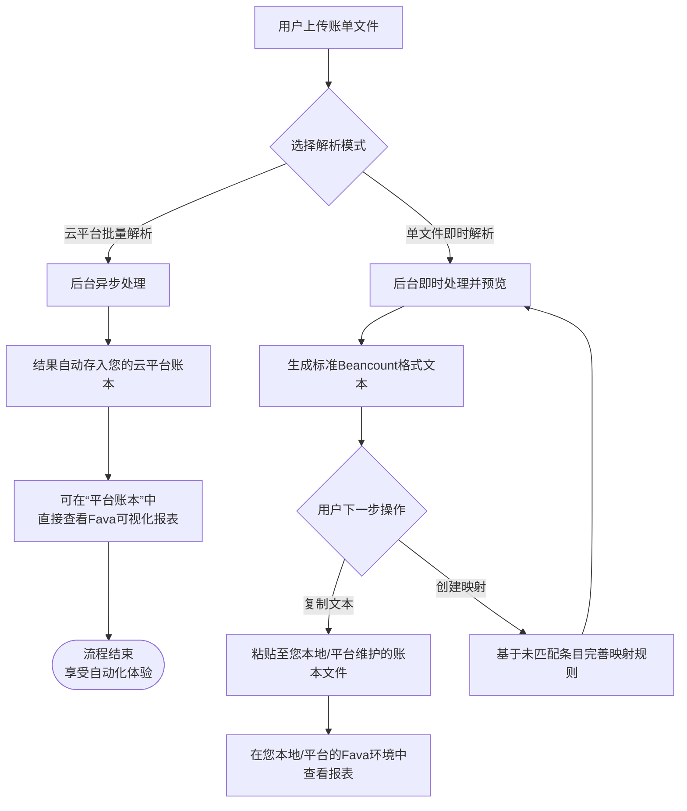

解析是 Beancount-Trans 平台的核心处理环节，它将您上传的原始账单文件转化为结构化的、可被专业记账软件识别的交易记录。本章将详细介绍两种解析模式以及完整的操作流程。

## 一、解析是什么？

**解析**，就像一个智能的**数据加工厂**。

- **输入**：您从支付宝、微信、银行导出的，格式不一的 `.csv` 或 `.xlsx` 原始账单文件。
- **处理**：工厂的流水线（解析引擎）会读取文件内容，并利用 **[映射规则](https://trans.dhr2333.cn/docs/%E7%94%A8%E6%88%B7%E6%8C%87%E5%8D%97/mapping)** 这本 " 说明书 "，将流水记录分类、翻译。
- **输出**：标准的 `Beancount` 格式交易记录，既可存入您的**云平台账本**，也可供您**复制使用**。

## 二、两种解析模式：我该用哪种？

平台提供两种解析模式，以满足不同场景的需求。您的工作流程取决于下方的决策流程图，它清晰地展示了两种模式的区别与最终产出：

## 三、准备工作：如何获取账单文件？

解析的前提是获得标准的账单文件。请参考我们为您准备的详细指南：[各渠道账单文件导出说明](https://trans.dhr2333.cn/docs/blog/2024/08/22/%E8%B4%A6%E5%8D%95%E5%AF%BC%E5%87%BA%E5%8F%8A%E6%9F%A5%E7%9C%8B%E6%96%B9%E6%B3%95) ，该链接提供了所有支持渠道的详细导出步骤。

> **💡 提示**：请确保导出的时间范围覆盖您需要记账的周期。

## 四、操作指南：云平台批量解析

此模式是**新手推荐**的主要工作流，真正做到 " 上传后即可查看报表 "。

### 1. 上传账单

1. 进入 **「文件管理」** 页面。
2. 点击 **「上传文件」** 按钮，选择您从支付平台下载的账单文件。
3. 上传成功后，文件会出现在列表中。

### 2. 提交解析

1. 在 **「文件管理」** 页面，勾选一个或多个账单文件。
2. 点击 **「批量解析」** 按钮，系统将创建解析任务。

### 3. 查看结果与状态

- 解析为**异步任务**，您可以在任务中心查看进度。
- 解析成功后，所有交易记录将**自动存入您的云平台总账本**。
- 您可以随时进入 **「账本管理」** -> **「平台账本」**，系统会自动启动您的专属 Fava 报表容器，查看所有可视化图表。

## 五、操作指南：单文件即时解析

此模式适合**专家用户**快速处理单个文件，或用于根据映射规则**校准账户**。

### 1. 上传与解析

1. 进入 **「解析」** 功能页面。
2. 点击上传区域或拖入文件，系统会**立即解析**并在下方显示两个结果区块。系统会自动应用 **[忽略策略](https://trans.dhr2333.cn/docs/%E7%94%A8%E6%88%B7%E6%8C%87%E5%8D%97/ignore)**。

### 2. 理解解析结果

单文件解析页面提供两种视角的结果：

**区块一：完整 Bean 格式文本**

- 这是解析后生成的标准 Beancount 格式文本，包含所有交易记录。
- 您可以点击 **「复制」** 按钮一键复制全部内容，然后粘贴到您本地的账本文件中。

**区块二：逐条记录分析表格**
这个表格为您提供每条记录的详细解析情况和 AI 分析，包含以下列：

- **账单格式化内容**：
  - 显示该条记录当前解析后的 Beancount 格式文本。
  - **点击可以复制单条记录**，方便您精细调整。
- **AI 分类反馈**：
  - **当前分类**：当前使用的映射账户。
  - **候选分类**：AI 提供的其他可能分类（基于语义相似度计算）。当多条映射规则最高优先级相同时，AI 会计算相似度并提供候选建议。
  - **操作**：点击任一候选分类，系统会**立即更新**该条记录的映射账户，并同步刷新 " 账单格式化内容 "。

### 3. 处理与优化解析结果

利用逐条记录表格，您可以精细化调整解析结果：

1. **审查 AI 推荐**：查看 **AI 分类反馈** 列中的候选分类，它们会提供语义相似度分数参考。
2. **选择更优分类**：如果您认为某个候选分类比当前分类更准确，直接点击它。
3. **实时观察变化**：您的选择会立即反映在：
    - 该条记录的 **账单格式化内容** 中（账户字段更新）
    - 上方的 **完整 Bean 格式文本** 中（相应记录同步更新）
4. **创建新映射（可选）**：如果您发现某个模式需要永久记住，可以前往【映射管理】页面创建新的映射规则。

### 4. 使用最终结果

- **复制全部结果**：调整满意后，点击 "**复制解析结果**" 按钮，即可得到完整的、更新后的 Beancount 格式文本。
- **存入本地账本**：将复制的内容粘贴到您本地维护的 `.bean` 账本文件中。
- **本地查看报表**：在您本地环境中运行 Fava，打开您的账本文件，即可查看合并后的报表。

## 六、常见问题 (FAQ)

**Q1: 云平台解析和单文件解析的结果有什么区别？**
**A:** **核心区别在于输出目的地**。云平台解析的结果自动存入您的云账本，直接生成报表；单文件解析的结果是文本，需要您手动复制到本地账本文件。

**Q2: 为什么有些交易没有出现在解析结果中？**
**A:** 这是正常的。系统会根据 **[忽略策略](https://trans.dhr2333.cn/docs/%E7%94%A8%E6%88%B7%E6%8C%87%E5%8D%97/ignore)** 自动过滤掉诸如 " 交易关闭 "、" 还款失败 "、" 等待付款 " 等类型的交易，以避免无关信息干扰您的核心账本。您可以在忽略文档中查看详细规则。

**Q3: 我能在单文件解析页面上直接修改文本吗？**
**A:** 目前不支持直接修改文本。我们推荐通过**选择 AI 候选分类**的方式来校准结果，这种方式有助于完善您的映射规则库，实现一劳永逸。对于特殊的、一次性的调整，建议您将最终文本复制到本地后，在您的账本编辑器中进行修改。

**Q4: 重新上传同一个文件，会生成重复的交易记录吗？**
**A:** 系统不允许上传同名文件，如果您将同一份账单以不同的文件名重新上传并解析，系统会将其视为新文件，从而生成重复记录。若不慎产生重复，可在平台账本中编辑您的主账本文件（如 `main.bean`），注释掉（在最前面加 `;` 号）包含重复文件的 `include` 语句行。重复记录会立即从报表中隐藏，且未来可恢复。

**Q5: 单文件解析时，AI 候选分类是如何产生的？**
**A:** 当多条映射规则最高优先级相同导致冲突时，系统会使用 AI 模型分析交易内容与各候选目标账户的语义相似度并展示候选分类。

---

**下一步：**

- **👉 [前往「解析」页面](https://trans.dhr2333.cn/trans)**：亲自上传一份账单体验一下！
- **👉 [学习映射管理](https://trans.dhr2333.cn/docs/%E7%94%A8%E6%88%B7%E6%8C%87%E5%8D%97/mapping)**：了解如何创建和管理规则，让解析结果更准确。
- **👉 [查看忽略策略](https://trans.dhr2333.cn/docs/%E7%94%A8%E6%88%B7%E6%8C%87%E5%8D%97/ignore)**：了解哪些交易会被自动过滤。
