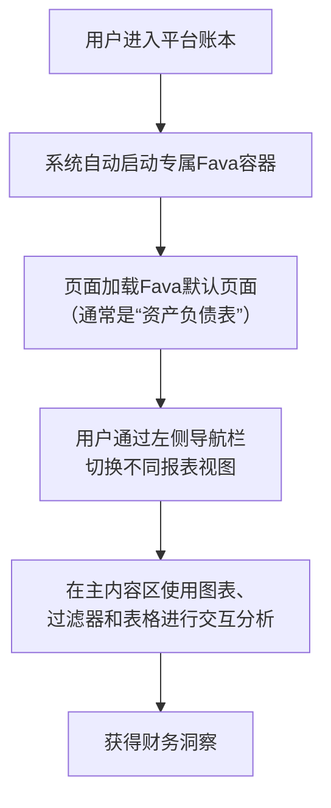

" 平台账本 " 页面由强大的开源报表工具 **[Fava](https://beancount.github.io/fava/)** 驱动。当您通过 Beancount-Trans 解析账单后，点击 **「账本管理」->「平台账本」**，系统会自动为您启动一个专属的、包含您所有交易数据的 Fava 服务。

以下是您在 Beancount-Trans 平台中使用 Fava 的核心流程和重点功能概览：

## 访问与核心流程

## Fava 主要功能模块速览

| 模块名 (英文)             | 中文惯称  | 核心用途说明              |
| :------------------- | :---- | :------------------ |
| **Balance Sheet**    | 资产负债表 | 查看特定日期的资产、负债和净资产状况。 |
| **Income Statement** | 损益表   | 分析一段时间内的收入、支出和净收益。  |
| **Journals**         | 日记账   | 查看所有最原始的交易记录。       |
| **Ledger**           | 试算表   | 按账户查看所有交易的明细。       |
| **Query**            | 查询    | 使用自定义语句进行高级筛选和查询。   |

> **💡 提示**：以上仅为部分核心功能。要探索 Fava 的全部能力（如事件、预算、高级图表等），请务必访问其 **[官方功能帮助手册](https://fava.pythonanywhere.com/example-beancount-file/help/)**。

## 温馨提示

- **数据来源**：您在此 Fava 报表中看到的所有数据，都来自于您通过 Beancount-Trans 【文件管理】上传并解析的账单。
- **首次使用**：如果您是首次使用，可能需要上传并解析一两个月的账单数据，才能看到丰富的报表内容。
- **探索发现**：充分利用 Fava 的**时间过滤器**和**账户过滤器**，可以从不同维度深度分析您的财务状况。
