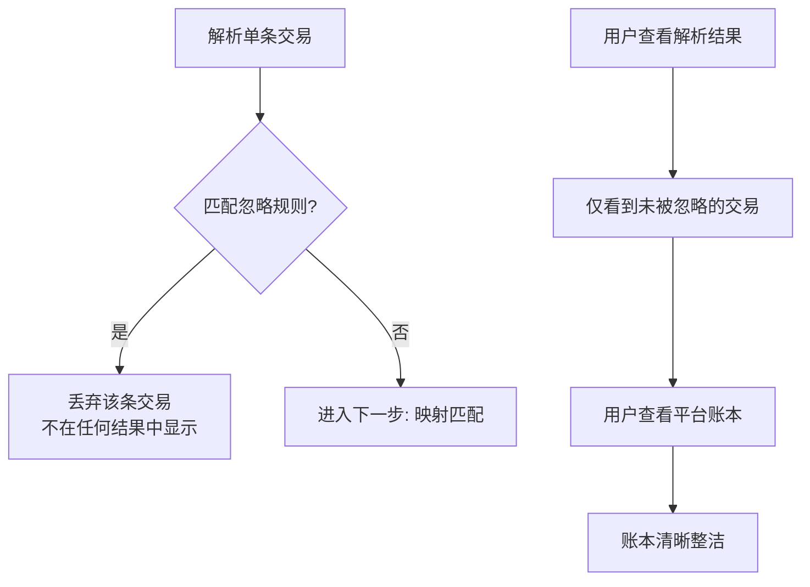

" 忽略 " 是 Beancount-Trans 平台的一项**自动化智能过滤功能**。它的目的是在解析过程中，自动识别并跳过那些通常不需要计入您核心账本的交易记录（如 " 支付失败 "、" 系统利息 " 等），让您的账本只保留有价值的主要收支，保持清晰和整洁。

## 一、为什么需要忽略功能？

想象一下您的原始账单是一条包含所有信号的**原始河流**，而您的账本是一个用于灌溉的**纯净水库**。

- **原始河流**：包含饮用水（有效交易）、泥沙（失败交易）、落叶（系统流水）。
- **忽略功能**就像一道**智能过滤网**，自动拦截泥沙和落叶，只让饮用水流入水库。
- **最终结果**：您无需手动清理，就能获得一个干净、可用于分析和报表的账本。

## 二、当前生效的默认忽略规则

系统会根据以下规则，在解析时自动忽略特定交易。被忽略的交易**不会**出现在您的解析结果和最终账本中。

| 忽略类型     | 典型关键字/场景举例                                                            | 忽略原因                 |
| :------- | :-------------------------------------------------------------------- | :------------------- |
| **交易失败** | `退款成功`, `交易关闭`, `解冻成功`, `信用服务使用成功`, `已关闭`, `还款失败`, `等待付款`, `芝麻免押下单成功` | 交易未实际发生，不影响账户余额。     |
| **系统流水** | `r'^余额宝.*收益发放$'` （正则表达式匹配）                                            | 属于平台系统行为，非个人主动消费/收入。 |
| **重复记录** | 借记卡、信用卡中重复记录支付宝和微信的交易（例如通过支付宝平台由借记卡付款，仅在支付宝账单中记录）                     | 避免同一笔交易在多个账单中重复记账。   |

## 三、特殊情况的处理说明

对于某些复杂场景，平台采用了更为审慎的策略，默认不予忽略，以确保用户数据的完整性。

| 场景类型 | 典型关键字/场景举例 | 处理方式 | 说明 |
| :--- | :--- | :--- | :--- |
| **账户互转** | `转账收款到余额宝`, `余额宝-自动转入`, `余额宝-单次转入` | **默认不忽略** | 为精确追踪每一分钱在所有账户（如现金、银行卡、余额宝）中的流动，系统默认记录所有内部转账。这是复式记账的核心要求。 |
| **微额交易** | `金额为0` 的交易 | **默认不忽略** | 存在诸如 " 就医刷医保个人账户支付 0 元 " 等需要记录事件但金额为 0 的真实场景，因此予以保留。 |

## 四、未来规划与您的参与

我们深知忽略需求因人而异，因此我们计划在未来版本中提供更灵活的功能。

### 规划中功能：自定义忽略规则

- **功能描述**：您将可以创建个人化的忽略规则，例如：忽略所有包含 " 手续费 " 的交易，或忽略金额小于 1 元的交易。
- **您的参与**：如果您对此功能有强烈的需求，或对规则有具体想法，欢迎在 [GitHub Issues](https://github.com/dhr2333/Beancount-Trans/issues) 中告诉我们。您的反馈将直接帮助我们确定功能的开发优先级和设计细节。

### 规划中功能：全局配置

- **功能描述**：提供开关，允许用户一键启用/禁用 " 忽略账户互转 " 或 " 忽略微额交易 " 等高级功能。
- **您的参与**：如果您认为上述 " 特殊场景 " 应该提供默认忽略的选项，请在 [GitHub Issues](https://github.com/dhr2333/Beancount-Trans/issues) 中提出并阐述您的用例。

## 五、流程与逻辑

下图展示了解析时，忽略功能是如何工作的：

## 六、常见问题 (FAQ)

**Q1: 我发现一笔交易被错误地忽略了，怎么办？**
**A:** 这可能是由于规则过于宽泛。请将您遇到的案例通过 [GitHub Issues](https://github.com/dhr2333/Beancount-Trans/issues) 反馈给我们，帮助我们优化默认规则。目前，您可能需要手动将这笔交易添加到您的本地账本文件中。

**Q2: 我想忽略 " 信用卡还款 " 或 " 余额宝转入 "，现在能做到吗？**
**A:** 目前无法通过平台配置自动忽略这类交易。当前的解决方案是：在**单文件解析**后，手动从生成的文本中删除这些行，再复制到您的账本中。我们已计划开发自定义忽略功能来彻底解决此类需求。

**Q3: 我想查看所有被忽略的交易，可以吗？**
**A:** 该功能已在规划中。未来我们将在解析结果页面提供一个 " 查看已忽略交易 " 的选项卡，方便您审核与复查，确保没有误操作。

**Q4: 忽略会影响我的原始账单文件吗？**
**A:** **绝对不会。** 忽略功能只在解析过程中生效，您的原始账单文件会完好无损地保存在云端，不会被修改或删除。

---

**下一步：**

- 如果您在账本中发现某些无关交易，可以检查其是否符合上述忽略规则。
- 如果您对忽略功能有任何想法或需求，欢迎在 [GitHub Issues](https://github.com/dhr2333/Beancount-Trans/issues) 与我们交流！
