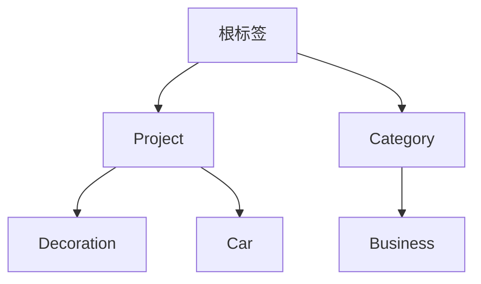

如果把账户比作 " 抽屉 "——将交易按去向分类存放，那么标签就是 " 便签纸 "——在交易上添加额外的语义标记。

账户回答 " 钱花在哪里 "，标签则回答 " 为什么花 " 或 " 什么性质 "。两者结合，让财务记录更立体、查询更灵活。

## 一、标签的核心作用

标签在 Beancount-Trans 中扮演补充角色，与账户形成互补：

- **提供额外维度**：在账户分类基础上增加语义标记，如标记项目、报销、旅游等
- **灵活分类**：不受 Beancount 五大账户类型限制，可自由定义任意维度的分类体系
- **映射关联**：与支出/资产/收入映射建立多对多关联，实现多维度标记和查询
- **报表增强**：在 Fava 等工具中通过标签过滤，回答更细粒度的问题，如 " 花在装修上的钱 "、" 某趟旅游花费的钱 "

## 二、树状结构：标签的组织体系

标签采用树形分层，使用斜杠 `/` 分隔层级：

关键特性：

- **层级分隔**：斜杠 `/` 分隔（账户用冒号 `:`）
- **自动创建**：输入 `Project/Decoration` 自动创建父标签
- **联动机制**：禁用父标签时，所有子标签自动禁用

## 三、标签生命周期管理

标签从创建到删除的完整流程：

1. **启用/禁用**：禁用父标签时，系统自动禁用所有子标签
2. **编辑**：可修改名称和描述，所对应的映射条目自动更新
3. **删除**：需删除子标签方可删除父标签

## 四、与其他模块的协同工作

标签与系统其他模块紧密协作，发挥补充作用：

- **映射**：一个映射可以关联多个标签，一个标签也可以关联多个映射
- **账单解析**：解析账单时，系统会**自动收集所有匹配到的映射关联的标签**，包括：

1. 最终选中的映射标签（如选中 `美团` 映射，其关联的 `Business` 标签会被添加）
2. 所有候选映射的标签（即使未选中，只要匹配到，其标签也会被收集）
3. 资产映射的标签（如支付宝余额、微信零钱等资产关联的标签）
4. 原始账单中的标签（如果账单文件本身包含标签）

这些标签会被自动去重合并，添加到最终的 Beancount 语句中。例如：`#Project/Decoration #Business`

## 五、标签设计最佳实践

> [!NOTE] 适度使用原则
> 只在需要回答 " 为什么 " 或 " 什么性质 " 时才使用标签。

- **📝 命名规范**：避免空格、`#` 等非法字符
- **🌳 层次设计**：保持 1-2 层结构
- **🎯 语义清晰**：使用有意义名称
- **🤝 与账户搭配**：账户管 " 哪里 "，标签管 " 为什么 "
- **⚖️ 适度使用**：避免过度标记

## 六、常见问题 (FAQ)

**Q1: 标签和账户有什么区别？**
**A:** 账户是基础分类，决定交易应该 " 放到哪个抽屉 "，遵循 Beancount 五大类型规范。标签是额外维度，提供 " 便签 " 功能，可自由定义。账户回答 " 钱花在哪里 "，标签回答 " 为什么花 " 或 " 什么性质 "。两者结合使用，能实现更立体的财务记录。

**Q2: 什么时候应该用标签而不是子账户？**
**A:** 当需要回答的问题类型不同时：

- **用账户**：回答 " 钱从哪里来/到哪里去 "，属于资金流向问题，如 `Expenses:Food:Lunch`
- **用标签**：回答 " 为什么花/什么性质 "，属于属性标记问题，如 `Business`、`Reimbursement`
- 例如：商务午餐用 `Expenses:Food`（账户）+ `Business`（标签），而非创建 `Expenses:Food:Business` 账户

**Q3: 标签支持中文吗？**
**A:** 不支持。Beancount-Trans 遵循 Beancount 语法，标签名称可以使用大小写英文、数字、下划线、横线和斜杠。

**Q4: 删除标签会影响已解析的交易吗？**
**A:** 不会直接删除已解析的交易，但会影响关联的映射。删除标签时，如果标签关联了映射，需要先在映射中移除该标签的关联。建议在删除标签前，先检查并处理相关映射。

---

**下一步：**

- 👉 现在您已经理解了标签，可以再次去【[账户](https://trans.dhr2333.cn/docs/%E7%94%A8%E6%88%B7%E6%8C%87%E5%8D%97/account)】页面加深对账户和标签的理解
- 👉 标签需要通过映射进行使用，可以通过【[映射管理](https://trans.dhr2333.cn/config/mappings)】为映射添加标签。
- 👉 想要查看标签在 Fava 中的展示效果？可以访问 [FAVA 官方示例账本](https://fava.pythonanywhere.com/example-beancount-file/income_statement/?filter=%23trip-boston-2017) 作为参考。

**怎么使用？**

- 您需要在 [标签管理](https://trans.dhr2333.cn/config/tags) 先定义不同维度的标签，如 `Project/Decoration`、`Person/dhr2333`
- 为映射添加一个或多个标签，在解析时会将所有被匹配到映射所包含的标签全部添加至解析结果
