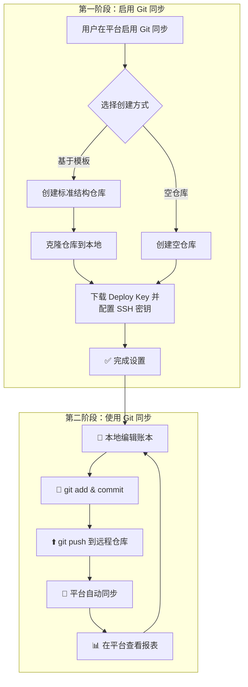

Git 同步功能让您能够将本地 Beancount 账本与平台无缝集成，享受版本控制、本地编辑和平台解析的强大组合。无论您是已有账本需要迁移，还是希望使用熟悉的编辑器进行账本管理，Git 同步都能满足您的需求。

## 一、总览：Git 同步能做什么？

Git 同步功能为 Beancount-Trans 平台增加了强大的版本控制和本地编辑能力：

- **版本控制**：通过 Git 管理账本变更历史，支持历史回溯和变更追踪
- **本地编辑**：使用 VS Code 等编辑器编辑账本，享受语法高亮和智能提示
- **多设备同步**：在不同设备间同步账本数据，随时随地访问和编辑
- **平台增值**：继续享受平台的 AI 解析、Fava 可视化等强大功能

### 核心工作流程



### 适用场景

- **已有账本迁移**：将本地 Beancount 账本迁移到平台，保留原有目录结构和配置
- **本地编辑偏好**：习惯使用 VS Code + Beancount 插件进行账本编辑
- **版本管理需求**：需要追踪账本变更历史，支持回滚和对比
- **离线编辑**：可以离线编辑账本，联网后同步到平台

## 二、启用 Git 同步功能

### 1. 进入设置页面

1. 登录 Beancount-Trans 平台
2. 悬停右上角用户名称，选择 **「个人设置」**
3. 在设置页面中找到 **「Git 同步」** Tab

### 2. 选择仓库创建方式

平台提供两种创建方式，根据您的需求选择：

#### 方式一：基于模板创建（推荐新手）

适合刚开始使用 Beancount 或希望遵循最佳实践的用户：

- ✅ 基于 [Beancount-Trans-Assets](https://github.com/dhr2333/Beancount-Trans-Assets) 标准模板创建
- ✅ 包含标准目录结构和示例文件
- ✅ 预配置账户体系和模板
- ✅ 开箱即用，无需额外配置
- ✅ 遵循 Beancount 最佳实践

#### 方式二：空仓库创建（推荐迁移用户）

适合已有 Beancount 账本需要迁移的用户：

- 📁 创建空仓库，等待推送现有账本
- 🔄 保留您现有的目录结构和配置
- ⚡ 快速迁移，无需重新组织
- 🛡️ 完全控制账本内容和结构

> **⚠️ 重要提示**：选择空仓库创建的用户，推送账本时必须遵循平台规范，详见下方「[非模板用户规范要求](#非模板用户规范要求)」章节。

### 3. 下载并配置 Deploy Key

仓库创建成功后，您需要下载 Deploy Key 并配置 SSH：

#### 步骤 1：下载 Deploy Key

1. 在 Git 同步设置页面，点击 **「下载 Deploy Key」** 按钮
2. 系统会自动下载一个 `.pem` 格式的私钥文件（文件名格式：`{用户名}_deploy_key.pem`）

#### 步骤 2：配置 SSH 密钥

将下载的 Deploy Key 配置到您的 SSH 配置中：

```shell
# 1. 设置密钥文件权限（必须）
chmod 600 ~/Downloads/{用户名}_deploy_key.pem

# 2. 配置 SSH config（可选，但推荐）
cat >> ~/.ssh/config << 'EOF'
Host gitea-beancount
    HostName gitea.dhr2333.cn
    Port 30022
    User git
    IdentityFile ~/Downloads/{用户名}_deploy_key.pem
    StrictHostKeyChecking no
EOF
```

> **💡 提示**：将 `{用户名}` 替换为您的实际用户名，将 `~/Downloads/` 替换为您的实际下载路径。

### 4. 克隆仓库到本地

配置好 SSH 后，就可以将仓库克隆到本地了：

```shell
# 方式一：使用 SSH 并配置仓库别名（推荐）
git clone gitea-beancount:beancount-trans/{uuid}-assets.git Assets

# 方式二：使用完整的 SSH URL 并指定密钥
git clone -c core.sshCommand='ssh -i ~/.ssh/your_private_key -p 30022' ssh://git@gitea.dhr2333.cn:30022/beancount-trans/{uuid}-assets.git Assets
```

> **💡 提示**：`{uuid}` 是平台为您分配的数字 ID

克隆成功后，您就可以在本地编辑账本了！

## 三、日常使用工作流

### 1. 本地编辑账本

使用您熟悉的编辑器（如 VS Code）打开克隆的仓库目录，开始编辑账本文件：

```shell
cd Assets/
code .  # 使用 VS Code 打开
```

在编辑器中，您可以：

- 使用 Beancount 插件享受语法高亮和错误检查
- 编辑账户定义、交易记录等所有账本内容
- 使用 Git 查看历史变更、对比差异

### 2. 推送修改到平台

编辑完成后，将修改推送到平台：

```shell
# 1. 查看修改内容
git status

# 2. 添加修改的文件
git add .

# 3. 提交修改（请使用有意义的提交信息）
git commit -m "更新2025年1月账本"

# 4. 推送到平台
git push origin main
```

推送成功后，平台会自动或手动同步您的修改。

### 3. 触发平台同步

平台同步用于将账本从远程仓库拉取到平台，供 Fava 读取展示

推送后，有两种方式让平台同步您的修改：

#### 方式一：自动同步（Webhook）

远程仓库默认配置 Webhook 并与平台集成，平台会在您 Push 后自动同步，无需手动操作。

#### 方式二：手动同步

1. 进入 **「个人设置」** -> **「Git 同步」** Tab
2. 点击 **「立即同步」** 按钮
3. 系统会从远程仓库拉取最新内容并更新平台账本
4. 同步完成后，您可以在 **「平台账本」** 中查看最新的报表

### 4. 获取平台解析结果

平台解析账单后，会将结果写入 `trans/` 目录。由于 `trans/` 目录不在 Git 管理中，您需要通过以下方式获取：

#### 下载解析结果

1. 在 Git 同步设置页面，点击 **「下载解析结果」** 按钮
2. 系统会生成一个 ZIP 压缩包，包含 `trans/` 目录下的所有解析文件
3. 解压后，您可以将 `trans/` 目录内容合并到本地账本中（可选）

> **💡 提示**：`trans/` 目录在 `.gitignore` 中被忽略，这是为了避免 Git 冲突。平台解析结果会持续更新，建议定期下载以保持本地与平台数据一致。

### 5. 查看同步状态

在 Git 同步设置页面，您可以实时查看：

- **同步状态**：待同步、同步中、成功、失败
- **最后同步时间**：最近一次同步的完成时间
- **错误信息**：如果同步失败，会显示具体的错误原因

## 四、目录结构说明

理解 [目录结构](https://github.com/dhr2333/Beancount-Trans-Assets?tab=readme-ov-file#%E7%9B%AE%E5%BD%95%E7%BB%93%E6%9E%84) 有助于更好地使用 Git 同步功能：

### 用户管理目录

这些目录由您通过 Git 管理，可以自由编辑和推送：

- `main.bean`：主账本入口文件，包含所有 include 语句
- `account/`：账户定义目录
- `2022_template/`、`2023_template/` 等：按年份组织的交易记录
- `document/`：文档存储目录（保存通过 Fava 上传的文件）
- `depreciation.bean`：折旧记录
- `.gitignore`：Git 忽略文件配置

### 平台管理目录（trans/）

`trans/` 目录由平台自动管理，包含平台解析账单后生成的结果：

- `trans/main.bean`：平台解析结果的入口文件
- `trans/{file_name}.bean`：各个账单文件的解析结果

**重要说明**：

- `trans/` 目录在 `.gitignore` 中被忽略，不会被 Git 管理
- `main.bean`（主账本入口文件）默认包含 `include "trans/main.bean"`，平台解析结果会自动显示在平台账本提供的 Fava 报表中
- 如果您手动修改 `main.bean`（主账本入口文件）使其没有包含 `include "trans/main.bean"`，也不影响平台正常运行，只是不会显示平台解析结果

### .gitignore 配置

平台会自动在仓库中配置 `.gitignore`，忽略以下内容：

```gitignore
trans/
```

这样可以确保：

- 平台解析结果不会被 Git 管理，避免冲突
- 用户完全控制需要版本控制的内容

### 非模板用户规范要求

如果您选择**空仓库创建**方式，推送账本时必须遵循以下规范，以确保平台 Fava 服务能正常运行：

**必须要求**：

- `main.bean` 文件必须位于仓库**根目录**（与 `.gitignore` 同级）
- `main.bean` 文件**包含** `include "trans/main.bean"` 语句
- `.gitignore` 文件**包含** `trans/` 目录

**原因**：平台 Fava 容器启动命令固定为 `fava main.bean`，且容器工作目录为仓库根目录。如果 `main.bean` 不在根目录或缺少 `include "trans/main.bean"`，平台解析结果将无法显示在 Fava 报表中。

**根目录 `main.bean` 示例**：

```beancount
; 账本信息
option "title" "我的账本"
option "operating_currency" "CNY"

2022-01-01 custom "fava-option" "language" "zh_CN"
plugin "beancount.plugins.auto_accounts"

; 您的交易记录
include "2023/00.bean"

; ⚠️ 必须包含此行，否则平台解析结果不会显示
include "trans/main.bean"
```

## 五、常见问题 (FAQ)

**Q1: 为什么 trans/ 目录不在 Git 中？**

**A:** 这是为了避免冲突。平台解析结果会频繁更新，如果纳入 Git 管理，每次同步都可能产生冲突。通过 `.gitignore` 忽略 `trans/` 目录，您可以完全控制需要版本控制的内容，同时通过下载功能获取平台解析结果。

**Q2: 推送后平台没有自动同步怎么办？**

**A:** 可以手动点击 **「立即同步」** 按钮触发同步。如果 Webhook 未配置或失效，平台会在您手动触发时同步。同步状态会实时显示在设置页面。

**Q3: 什么时候需要重新生成 Deploy Key？**

**A:** 通常在以下情况下需要重新生成 Deploy Key：

1. Deploy Key 遗失或被泄露时，为了保证账户安全应立即更换。
2. 更换或重装了本地设备，需要新的 Deploy Key 配置到新环境时。
3. 平台提示 Deploy Key 已失效或需要更新时。

重新生成后，您需要按照以下步骤操作：

1. 下载新的 Deploy Key
2. 设置密钥文件权限，并更新本地 SSH 配置中的密钥路径

**Q4: 本地修改和平台解析结果会产生冲突吗？**

**A:** 不会。平台采用单向同步策略（只 pull，不 push），且 `trans/` 目录被 Git 忽略。您的本地修改和平台解析结果完全分离，不会产生冲突。

**Q5: 仓库大小有限制吗？**

**A:** 是的，仓库大小限制为 20MB。这个限制足以满足个人账本的需求。如果您的账本文件较大，建议：

- 定期归档历史年份的账本
- 使用 Git 的压缩功能
- 避免在仓库中存储大文件（如图片、PDF 等）
- 通过 [邮箱](mailto:dhr2diary@gmail.com) 联系开发者调整

**Q6: 可以在多个设备上使用同一个仓库吗？**

**A:** 可以。Git 支持多设备协作：

1. 在每个设备上配置相同的 Deploy Key
2. 克隆仓库到本地
3. 编辑后推送到平台
4. 在其他设备上执行 `git pull` 获取最新内容

---

**下一步：**

现在您已经了解了 Git 同步功能，可以开始使用了！

- **👉 [前往「个人设置」](https://trans.dhr2333.cn/settings)**：启用 Git 同步功能，开始您的版本控制之旅
- **👉 [查看「平台账本」](https://trans.dhr2333.cn/docs/%E7%94%A8%E6%88%B7%E6%8C%87%E5%8D%97/ledger)**：了解如何在平台查看 Fava 可视化报表
- **👉 [学习「解析」功能](https://trans.dhr2333.cn/docs/%E7%94%A8%E6%88%B7%E6%8C%87%E5%8D%97/translate)**：了解如何通过平台解析账单并自动写入 trans/ 目录
