模板系统是 Beancount-Trans 平台的核心基础设施，它让新用户能够在几分钟内快速搭建起完整的记账体系，而不需要从零开始手动创建数百条映射规则和账户结构。本文将详细介绍模板系统的工作原理和使用方法。

## 一、什么是模板？为什么需要它？

### 1. 一个生动的比喻

想象一下，您刚搬进一个新家，需要整理收纳系统：

- **账户模板**就像是一个**空房子的房间规划图**：它定义了 " 客厅 "、" 卧室 "、" 厨房 " 的位置和用途，告诉您 " 东西应该放在哪里 "
- **映射模板**就像是贴在每个抽屉上的**标签清单**：它定义了 " 看到 ' 麦 ' 字就放进 ' 食品抽屉 '，看到 ' 滴滴 ' 就放进 ' 交通抽屉 '"，告诉您 " 如何识别和分类东西 "

如果您从零开始，需要：
- 规划整个房子的布局（创建账户体系）
- 为每个物品制定分类规则（创建映射规则）

而模板系统让您**一键复制**这些成熟方案，立即开始使用。

### 2. 为什么需要模板？

**痛点：从零开始的成本太高**

假设您要手动搭建一个完整的记账系统：

1. 创建账户结构：至少需要 50-100 个账户（`Expenses:Food:Breakfast`、`Expenses:Food:Lunch`、`Assets:Bank:ICBC` 等）
2. 创建映射规则：至少需要 200-500 条映射（各种商家、平台、场景）
3. 时间成本：即使每个操作只需 30 秒，总计也需要数小时

**解决方案：模板系统**

- **官方模板**：平台预置了经过精心设计的模板，覆盖 90% 的常见场景
- **社区模板**：其他用户分享的优质模板，可以一键应用
- **自定义模板**：将自己的账户结构和映射规则保存为模板，便于备份和分享

### 3. 两种模板的协作关系

账户模板和映射模板是**配套使用**的，它们的协作关系如下：

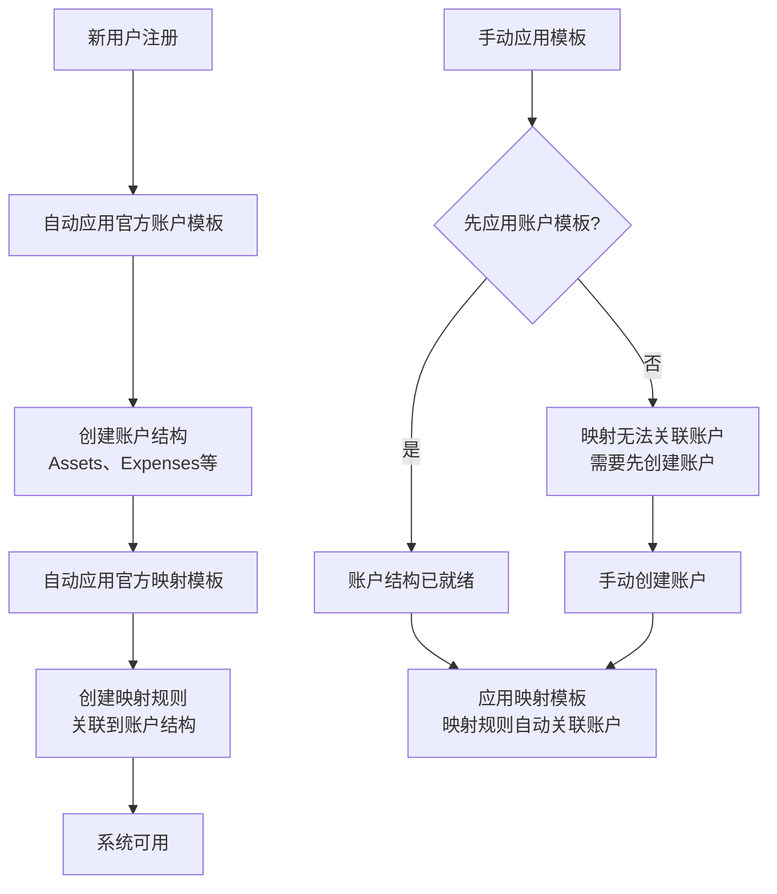

1. **先账户，后映射**：映射规则必须关联到已存在的账户，因此建议先应用账户模板。
2. **路径匹配**：映射模板会通过账户路径（如 `Expenses:Food:Restaurant`）查找用户对应的账户
3. **自动关联**：如果用户已有相同路径的账户，映射会自动关联；==如果没有，映射的账户字段为空（可后续手动关联）==

## 二、账户模板详解

### 1. 账户模板是什么？

账户模板定义了一套**完整的账户结构**，包含所有账户的路径和初始状态。

**数据模型**：

```
账户模板 (AccountTemplate)
├── 基本信息
│ ├── 名称：如 " 标准个人账户体系 "
│ ├── 描述：模板的说明文字
│ ├── 版本号：如 "1.0.0"
│ ├── 是否公开：是否允许其他用户查看
│ └── 是否官方：平台预置的模板
├── 模板项列表 (AccountTemplateItem[])
│ ├── 账户路径：如 "Expenses:Food:Breakfast"
│ └── 启用状态：该账户默认是否启用
└── 所有者：模板的创建者
```

**示例**：

一个账户模板可能包含以下模板项：

| 账户路径 | 启用状态 | 说明 |
|---------|---------|------|
| `Assets:Cash` | ✓ | 现金 |
| `Assets:Bank:ICBC` | ✓ | 工商银行 |
| `Assets:Digital:Alipay` | ✓ | 支付宝 |
| `Expenses:Food:Breakfast` | ✓ | 早餐 |
| `Expenses:Food:Lunch` | ✓ | 午餐 |
| `Expenses:Transport:Taxi` | ✓ | 出租车 |
| `Income:Salary` | ✓ | 工资收入 |

### 2. 账户模板的内部工作原理

#### 2.1 创建账户模板

当您创建一个账户模板时，系统会：

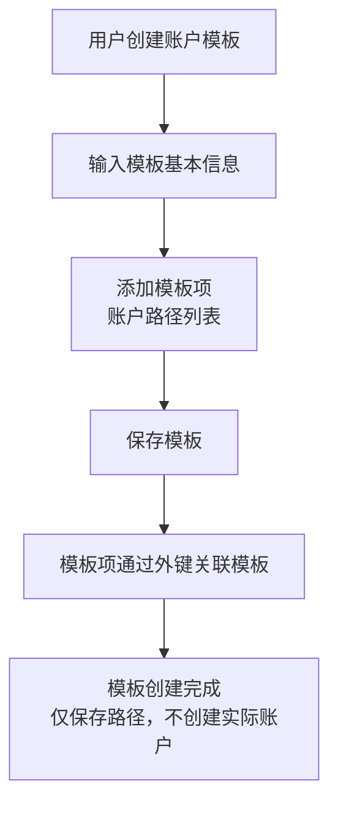

**重要特性**：
- 模板项只保存**账户路径字符串**，不创建实际的账户对象
- 模板可以被多个用户共享（如果是公开模板）
- 模板创建者可以随时更新模板，不影响已应用的用户

#### 2.2 应用账户模板

当您应用一个账户模板时，系统会执行以下逻辑：

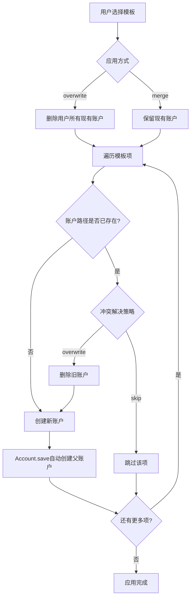

1. **选择应用方式**：
   - **`overwrite`（覆盖）**：删除用户所有现有账户，重新创建模板中的所有账户
   - **`merge`（合并）**：保留现有账户，只创建模板中不存在的账户

2. **遍历模板项**：
   - 对于每个 `AccountTemplateItem`，系统读取 `account_path`（如 `Expenses:Food:Breakfast`）

3. **检查冲突**（仅在 merge 模式）：
   - 查询用户是否已有相同路径的账户：`Account.objects.filter(owner=user, account=item.account_path).first()`
   - 如果存在：
	 - `conflict_resolution='skip'`：跳过该项，保留现有账户
	 - `conflict_resolution='overwrite'`：删除现有账户，创建新账户

4. **创建账户**：
   Account.objects.create(
	   owner=user,
	   account=item.account_path, # 如 "Expenses:Food:Breakfast"
	   enable=item.enable # 模板项定义的启用状态
   )
	  - **关键特性**：`Account.save()` 方法会自动创建所有父账户
   - 例如，创建 `Expenses:Food:Breakfast` 时，如果 `Expenses` 和 `Expenses:Food` 不存在，系统会自动创建它们

5. **结果统计**：
   - `created`：新创建的账户数量
   - `skipped`：跳过的账户数量（仅 merge 模式）
   - `overwritten`：覆盖的账户数量（仅 merge 模式）

### 3. 账户模板的应用场景

#### 场景一：新用户注册

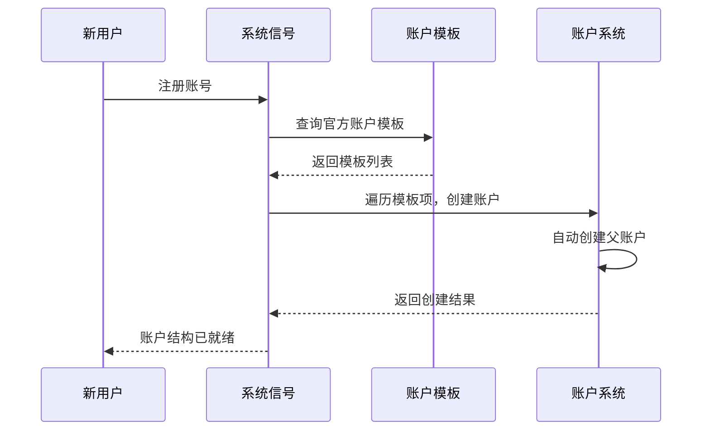

**代码位置**：`account/signals.py` - `apply_official_account_templates_on_signup()`

#### 场景二：切换账户体系

假设您之前使用的是简化版账户体系，现在想切换到完整版：

1. 在【账户模板】页面浏览可用的模板
2. 选择 " 标准个人账户体系（完整版）"
3. 选择 `merge` 模式，`conflict_resolution='skip'`
4. 系统会：
   - 保留您现有的账户（如 `Expenses:Food`）
   - 只创建模板中有但您没有的账户（如 `Expenses:Food:Breakfast`）

#### 场景三：多套账户体系

某些用户可能需要多套账户体系（如个人账户、家庭账户、公司账户），可以：
1. 创建多个账户模板
2. 在需要时切换应用不同的模板
3. 通过账户路径前缀区分（如 `Personal:Expenses:Food` 和 `Family:Expenses:Food`）

## 三、映射模板详解

### 1. 映射模板是什么？

映射模板定义了一套**完整的映射规则集合**，包含关键字、目标账户、商家等信息。

**数据模型**：

```
映射模板 (Template)
├── 基本信息
│ ├── 名称：如 " 常见商家映射 "
│ ├── 描述：模板的说明文字
│ ├── 类型：expense（支出）/ income（收入）/ assets（资产）
│ ├── 版本号：如 "1.0.0"
│ ├── 是否公开：是否允许其他用户查看
│ └── 是否官方：平台预置的模板
├── 模板项列表 (TemplateItem[])
│ ├── 关键字：如 " 麦当劳 "
│ ├── 账户：模板创建者的账户对象（ForeignKey）
│ ├── 商家（Payee）：如 " 麦当劳 "
│ ├── 付款方（Payer）：收入模板使用
│ ├── 账户全称（Full）：资产模板使用
│ └── 货币代码：如 "CNY" 或 "COIN"
└── 所有者：模板的创建者
```

**示例**：

一个支出映射模板可能包含以下模板项：

| 关键字 | 商家 | 目标账户路径 | 货币 |
|-------|------|------------|------|
| 麦当劳 | 麦当劳 | `Expenses:Food:Restaurant` | CNY |
| 星巴克 | 星巴克 | `Expenses:Food:Coffee` | CNY |
| 滴滴出行 | 滴滴 | `Expenses:Transport:Taxi` | CNY |
| 微信支付 | 微信 | `Assets:Digital:WeChat` | CNY |

### 2. 映射模板的内部工作原理

#### 2.1 创建映射模板

当您创建一个映射模板时：

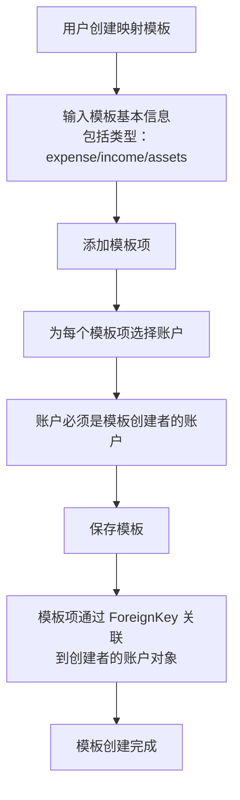

**重要特性**：
- 模板项的 `account` 字段是一个 **ForeignKey**，指向**模板创建者**的账户对象
- 这意味着不同用户应用同一个模板时，需要**将创建者的账户路径映射到自己的账户**
- 例如：模板创建者有一个账户 `Expenses:Food:Restaurant`（ID=100），另一个用户应用模板时，系统需要查找该用户是否有相同路径的账户（可能 ID=200）

#### 2.2 应用映射模板（当前实现的问题）

**⚠️ 已知问题**：当前实现直接使用 `item.account`（模板创建者的账户对象），导致新用户的映射关联到模板创建者的账户。

**当前错误流程**：

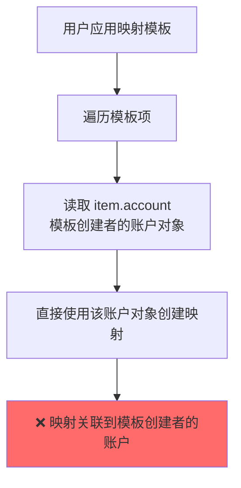
**正确流程（修复后）**：

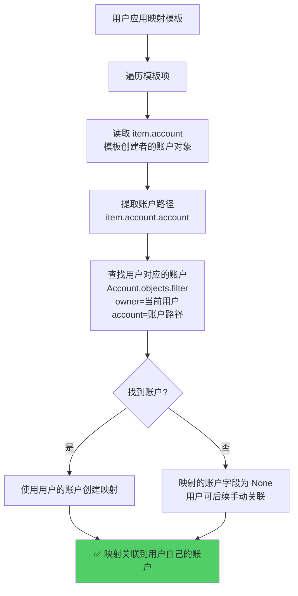

**修复方案**（已在计划中）：

在 `TemplateViewSet` 中添加 `_get_user_account()` 方法：

```python
def _get_user_account(self, template_account):
	"""
	根据模板中的账户，获取当前用户对应的账户
	
    Args:
        template_account: 模板中的账户对象（可能为None）
        
    Returns:
        当前用户的账户对象，如果模板账户为None或找不到则返回None
    """
    if template_account is None:
        return None
        
    # 获取账户路径
    account_path = template_account.account
    
    # 根据账户路径和当前用户查找对应的账户
    from project.apps.account.models import Account
    user_account = Account.objects.filter(
        owner=self.request.user,
        account=account_path
    ).first()
    
    return user_account
```
	
然后在三个应用方法中使用：
- `_apply_expense_template()`：`expend=self._get_user_account(item.account)`
- `_apply_income_template()`：`income=self._get_user_account(item.account)`
- `_apply_assets_template()`：`assets=self._get_user_account(item.account)`

#### 2.3 应用映射模板的完整流程

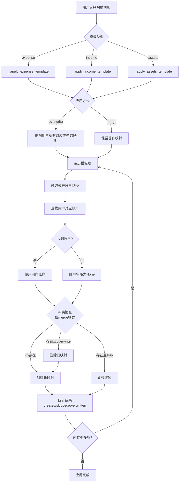
	
**详细说明**：

1. **根据模板类型选择处理逻辑**：
   - `expense` → 创建 `Expense` 对象
   - `income` → 创建 `Income` 对象
   - `assets` → 创建 `Assets` 对象

2. **处理冲突**（仅在 merge 模式）：
   - 查询用户是否已有相同关键字的映射
   - 如果存在：
	 - `conflict_resolution='skip'`：跳过该项
	 - `conflict_resolution='overwrite'`：删除现有映射，创建新映射

3. **账户关联逻辑**（修复后）：
   - 从模板项的 `account` 字段获取账户路径
   - 查找用户是否有相同路径的账户
   - 如果找到：使用用户的账户
   - 如果未找到：映射的账户字段为 `None`（用户可后续手动关联）

1. **创建映射对象**：
```
# 支出映射
   Expense.objects.create(
	   owner=user,
	   key=item.key, # 关键字
	   payee=item.payee, # 商家
	   expend=user_account, # 用户自己的账户对象（修复后）
	   currency=item.currency # 货币代码
   )
```
### 3. 映射模板的应用场景

#### 场景一：新用户注册

新用户注册时，系统会自动应用所有官方映射模板：

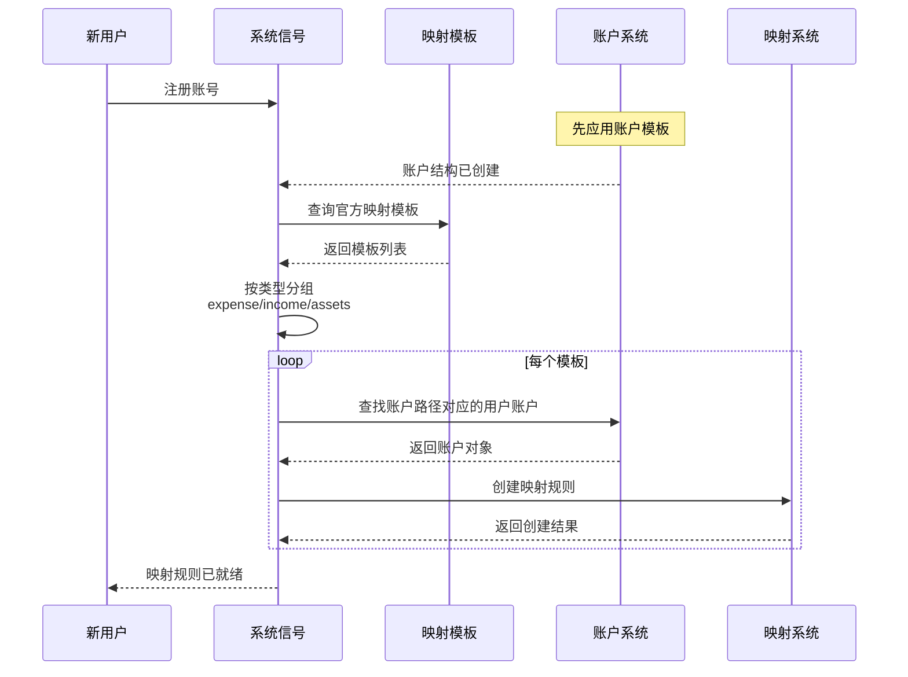

**代码位置**：`maps/signals.py` - `apply_official_templates_on_signup()`

**注意**：由于账户关联的已知问题，当前新用户注册后，映射可能关联到错误的账户。修复后，映射会正确关联到用户自己的账户。

#### 场景二：扩展映射规则

假设您已经有一些映射规则，但想添加更多：

1. 在【映射模板】页面浏览公开模板
2. 选择 " 外卖平台映射 " 模板
3. 选择 `merge` 模式，`conflict_resolution='skip'`
4. 系统会：
   - 保留您现有的映射规则
   - 只添加模板中有但您没有的映射（基于关键字判断）
   - 自动关联到您的账户（如果路径匹配）

#### 场景三：快速切换映射体系

某些用户可能需要在不同场景下使用不同的映射规则：

1. 创建多个映射模板（如 " 个人消费映射 "、" 商务消费映射 "）
2. 需要时应用不同的模板
3. 可以通过 `overwrite` 模式快速切换整个映射体系

## 四、模板的协作关系

### 1. 账户模板 → 映射模板的依赖关系

**核心原则**：映射模板依赖于账户模板。

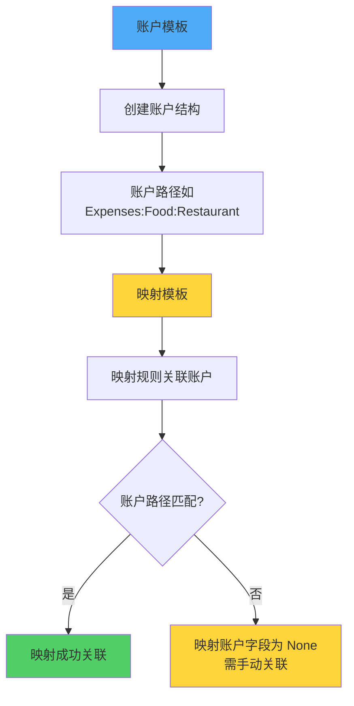

**为什么需要先应用账户模板？**

1. **映射规则必须关联账户**：每条映射规则都有一个 `account` 字段，指向一个具体的账户对象
2. **路径匹配机制**：映射模板通过账户路径查找用户对应的账户，如果账户不存在，映射的账户字段为空
3. **用户体验**：如果映射的账户字段为空，用户需要手动关联，增加了使用成本

### 2. 应用顺序的重要性

**推荐顺序**：

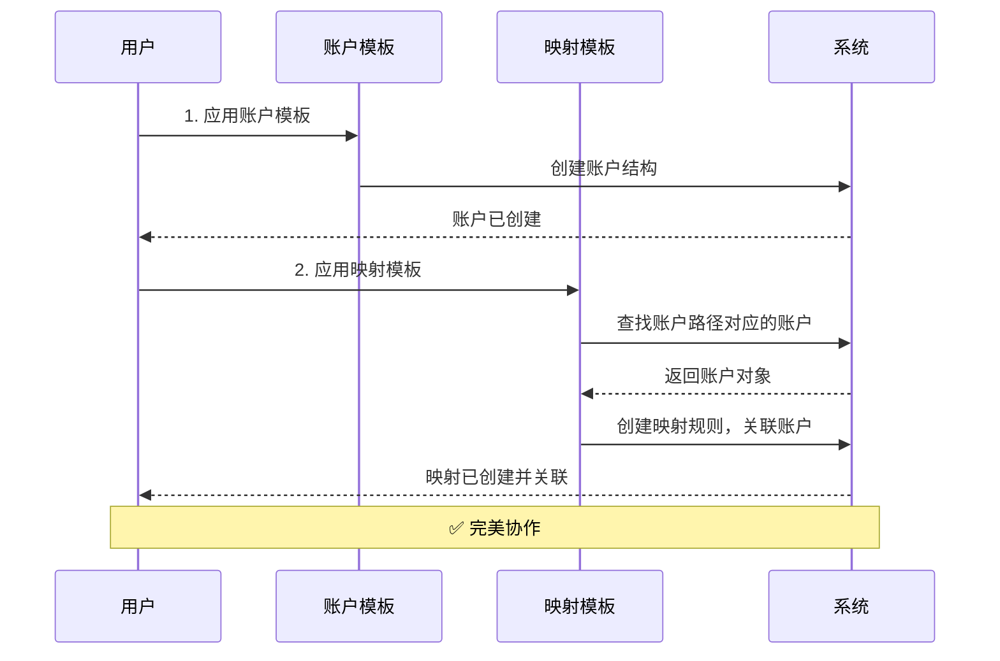

**错误顺序的后果**：

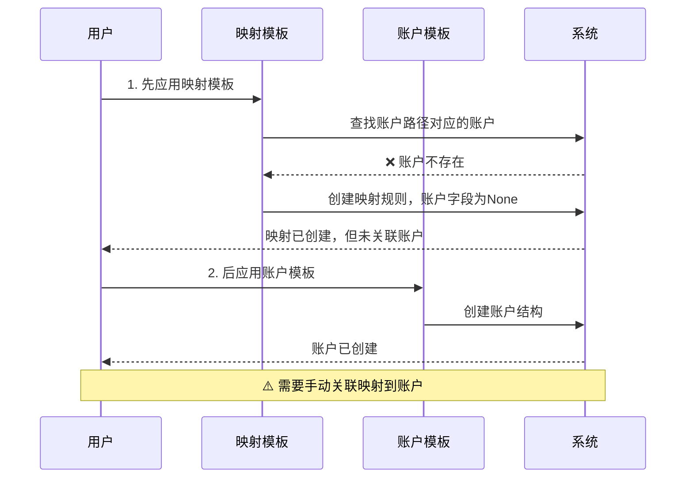
### 3. 自动应用机制

系统在用户注册时会**自动按正确顺序应用模板**：

```
# 1. 先应用账户模板
apply_official_account_templates(user)

# 2. 再应用映射模板
apply_official_templates(user)
```

**代码位置**：
- 账户模板：`account/signals.py` - `apply_official_account_templates_on_signup()`
- 映射模板：`maps/signals.py` - `apply_official_templates_on_signup()`

**触发场景**：
1. 通过 `django-allauth` 注册（信号：`user_signed_up`）
2. 验证码登录自动注册（`PhoneAuthViewSet.login_by_code()`）
3. OAuth 登录自动注册（`CustomSocialAccountAdapter.save_user()`）

## 五、模板的权限和可见性

### 1. 模板的可见性规则

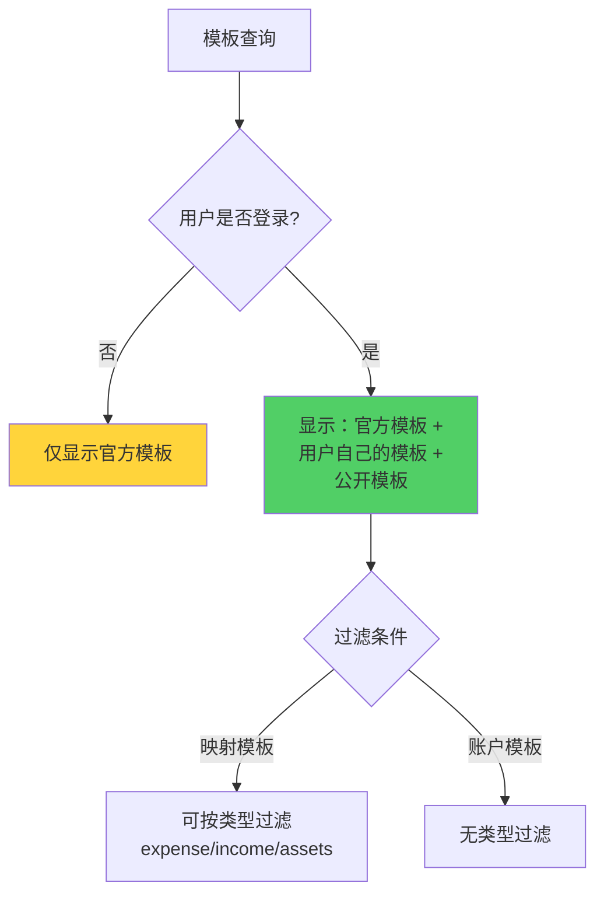

**详细规则**：

| 模板类型    | 官方模板      | 用户自己的模板 | 公开模板       | 其他用户的私有模板 |
| ------- | --------- | ------- | ---------- | --------- |
| **可见性** | ✅ 所有用户可见  | ✅ 创建者可见 | ✅ 所有登录用户可见 | ❌ 不可见     |
| **可应用** | ✅ 是       | ✅ 是     | ✅ 是        | ❌ 否       |
| **可编辑** | ❌ 否（仅管理员） | ✅ 是     | ❌ 否（仅创建者）  | ❌ 否       |

### 2. 模板的创建和编辑权限

**账户模板**：
- **创建**：任何登录用户都可以创建自己的模板
- **编辑**：只能编辑自己创建的模板（官方模板需要管理员权限）
- **删除**：只能删除自己创建的模板

**映射模板**：
- **创建**：任何登录用户都可以创建自己的模板
- **编辑**：只能编辑自己创建的模板
- **删除**：只能删除自己创建的模板
- **类型限制**：每个用户可以创建多个同类型的模板，但同一用户、同一类型的模板名称必须唯一

## 六、模板应用的最佳实践

### 1. 新用户入门流程

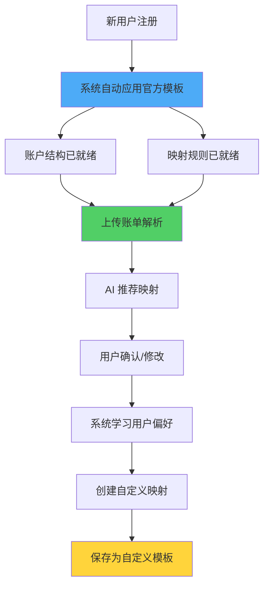

**步骤说明**：

1. **注册账号**：系统自动应用官方账户模板和映射模板
2. **上传账单**：体验 AI 推荐和自动分类
3. **调整映射**：根据个人需求创建或修改映射规则
4. **保存模板**：将自己的账户结构和映射规则保存为模板，便于备份和分享

### 2. 模板应用策略

#### 策略一：渐进式扩展（推荐）

1. **初始阶段**：使用官方模板，快速开始
2. **使用阶段**：根据实际需求，逐步添加自定义映射
3. **成熟阶段**：将完善的体系保存为自定义模板

**优点**：
- 学习成本低
- 逐步完善，不易出错
- 保持系统整洁

#### 策略二：一次性切换

1. **选择模板**：选择一个完整的社区模板
2. **备份数据**：导出现有映射和账户（如有）
3. **应用模板**：使用 `overwrite` 模式，替换整个体系
4. **微调优化**：根据个人需求调整

**适用场景**：
- 对现有体系不满意
- 希望快速切换到更成熟的方案
- 愿意承担一定学习成本

### 3. 模板冲突处理策略

#### 场景：应用模板时出现冲突

**Merge 模式的冲突处理**：

| 冲突项 | `conflict_resolution='skip'` | `conflict_resolution='overwrite'` |
|-------|---------------------------|--------------------------------|
| **账户模板** | 保留现有账户，跳过模板项 | 删除现有账户，使用模板项 |
| **映射模板** | 保留现有映射，跳过模板项 | 删除现有映射，使用模板项 |
| **适用场景** | 想保留现有配置，只添加新项 | 想用模板替换现有配置 |

**建议**：
- **初次应用**：使用 `merge` + `skip`，保留现有配置
- **更新模板**：使用 `merge` + `overwrite`，用新模板替换冲突项
- **完全重建**：使用 `overwrite`，清空现有配置，使用模板

### 4. 模板维护建议

#### 创建自定义模板

1. **命名规范**：使用清晰、描述性的名称，如 " 个人消费映射（2025 版）"
2. **版本管理**：使用版本号（如 `1.0.0`）标记模板版本
3. **更新说明**：在 `update_notes` 中记录更新内容
4. **公开分享**：如果模板质量高，可以设置为公开，帮助其他用户

#### 定期更新模板

1. **检查官方更新**：定期查看是否有新的官方模板版本
2. **合并新功能**：使用 `merge` 模式，将新功能合并到现有体系
3. **清理冗余**：删除不再使用的旧模板

## 七、常见问题 (FAQ)

**Q1: 应用模板后，我的现有数据会丢失吗？**

**A:** 这取决于您选择的模式：
- **`overwrite` 模式**：会删除所有现有账户/映射，然后创建模板中的项
- **`merge` 模式**：会保留现有账户/映射，只添加模板中不存在的项

建议初次使用选择 `merge` + `conflict_resolution='skip'`，这样可以保留现有配置。

**Q2: 为什么映射模板应用后，有些映射的账户字段是空的？**

**A:** 这可能是因为：
1. **账户路径不匹配**：映射模板中的账户路径在您的账户体系中不存在
2. **未先应用账户模板**：建议先应用对应的账户模板，再应用映射模板
3. **路径不一致**：模板使用的是 `Expenses:Food:Restaurant`，但您的是 `Expenses:Food:Restaurants`（复数形式）

解决方法：
- 检查模板使用的账户路径
- 手动关联映射到正确的账户
- 或者先应用对应的账户模板

**Q3: 我可以修改官方模板吗？**

**A:** 不可以直接修改官方模板（需要管理员权限）。但您可以：
1. **创建副本**：基于官方模板创建自己的模板
2. **合并修改**：应用官方模板后，手动调整，然后保存为自己的模板

**Q4: 模板应用后，为什么我的账户结构看起来不对？**

**A:** 可能的原因：
1. **父账户缺失**：虽然 `Account.save()` 会自动创建父账户，但如果模板项的路径不规范，可能导致结构异常
2. **路径冲突**：不同模板使用了相似的路径，导致账户结构混乱

解决方法：
- 检查账户路径是否符合 Beancount 规范（使用冒号分隔层级）
- 确保账户路径的唯一性和一致性
- 如有问题，可以使用 `overwrite` 模式重新应用模板

**Q5: 我可以导入/导出模板吗？**

**A:** 目前模板系统通过 API 管理，暂不支持直接的 CSV 导入/导出。但您可以：
1. **API 导出**：通过 API 获取模板数据
2. **手动复制**：在界面上查看模板内容，手动创建相似的模板
3. **备份账户和映射**：分别导出账户和映射数据，作为模板的备份

**Q6: 多个用户可以共享一个模板吗？**

**A:** 可以，但有限制：
- **官方模板**：所有用户都可以使用
- **公开模板**：所有登录用户都可以查看和应用，但只能由创建者编辑
- **私有模板**：只有创建者可以使用

**Q7: 模板更新后，已应用的用户会自动更新吗？**

**A:** 不会自动更新。模板的更新不会影响已经应用过该模板的用户。如果您想使用新版本的模板：
1. 查看模板的 `update_notes` 了解更新内容
2. 手动应用新版本的模板（使用 `merge` 或 `overwrite` 模式）

**Q8: 账户模板和映射模板可以分开应用吗？**

**A:** 可以，但**强烈建议按顺序应用**：
1. 先应用账户模板（创建账户结构）
2. 再应用映射模板（创建映射规则并关联账户）

如果顺序相反，映射可能无法正确关联到账户，需要手动关联。

---

**下一步：**

- 👉 现在您已经理解了模板系统，可以在【[账户模板](https://trans.dhr2333.cn/account/templates)】和【[映射模板](https://trans.dhr2333.cn/map/templates)】页面探索可用的模板了！
- 👉 如果您想深入了解账户结构的设计，可以参考【[账户管理](https://trans.dhr2333.cn/docs/%E7%94%A8%E6%88%B7%E6%8C%87%E5%8D%97/account)】文档。
- 👉 如果您想了解映射规则的详细用法，可以参考【[映射](https://trans.dhr2333.cn/docs/%E7%94%A8%E6%88%B7%E6%8C%87%E5%8D%97/mapping)】文档。
