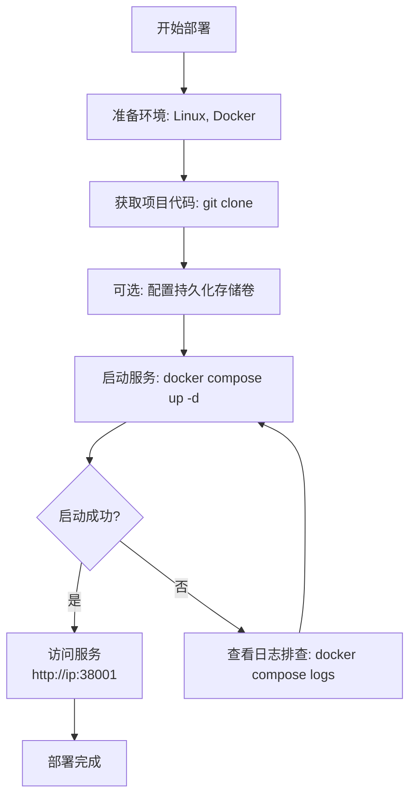

本文将指导您如何在您自己的服务器上部署 Beancount-Trans，实现数据的完全私有化。

## 一、先决条件

在开始之前，请确保您的部署目标机器满足以下要求：

| 项目                 | 要求                                                   | 检查命令                     |
| :----------------- | :--------------------------------------------------- | :----------------------- |
| **操作系统**           | 无强制要求，但建议使用主流的 Linux 发行版（如 Ubuntu 22.04, CentOS 7+）  | `cat /etc/os-release`    |
| **Docker**         | 已安装 Docker Engine。版本 ≥ 20.10.0。                      | `docker --version`       |
| **Docker Compose** | 已安装 Docker Compose（插件或独立版本皆可）。版本 ≥ v2.0.0。           | `docker compose version` |
| **硬件资源**           | 建议至少 **2 核 CPU，4GB 内存，20GB 可用磁盘空间**。                 | `free -h`, `df -h`       |
| **网络**             | 服务器需能访问互联网（以下载 Docker 镜像）。如需外部访问，请开放相应端口（如 `38001`）。 | `ping 8.8.8.8`           |

> **💡 重要提示**：在 Windows 和 macOS 上，Docker 实际上是运行在一个轻量级的 Linux 虚拟机中。对于 **生产环境部署，我们强烈建议使用 Linux 服务器**，以获得更好的性能和资源利用率。

### 必备环境安装

如果您的系统尚未安装 Docker 和 Docker Compose，请执行以下命令：

```shell
# 以 Ubuntu 为例，使用官方脚本快速安装 Docker Engine
curl -fsSL https://get.docker.com -o get-docker.sh
sudo sh get-docker.sh

# 安装 Docker Compose Plugin (推荐)
sudo apt-get update && sudo apt-get install docker-compose-plugin

# 验证安装
docker --version
docker compose version
```

## 二、快速开始部署

Beancount-Trans 使用 Docker Compose 编排所有服务，只需几个命令即可完成部署。

### 1. 获取项目代码

```shell
git clone https://github.com/dhr2333/Beancount-Trans.git
cd Beancount-Trans
git submodule update --init  # 初始化所有子模块
```

### 2. 启动所有服务

在项目根目录下，执行以下命令来启动所有容器：

```shell
# 前台启动（用于调试，查看日志）
docker compose up

# 或，后台启动（用于生产环境）
docker compose up -d
```

首次运行时会自动拉取镜像并创建所有容器、网络和**临时存储卷**。

### 3. 访问服务

容器启动成功后，即可通过以下地址访问服务：

- **Beancount-Trans 主界面**： http://your-server-ip:38001/trans
- **API 文档**： http://your-server-ip:38001/api/redoc

> **恭喜！** 至此，一个用于测试和体验的基础环境已经部署完成。**请注意：此默认配置使用临时存储卷，容器重建后数据将会丢失。** 对于生产用途，请继续阅读下文进行持久化配置。

## 三、生产环境配置

为了让您的数据持久化保存，您需要配置外部存储卷和数据库密码。

### 1. 数据持久化

1. 创建外部存储卷：

在使用 `docker compose up` 首次运行项目时，系统会自动创建外部存储卷。若以存在外部存储卷，则无需重复创建。

```shell
docker volume create postgres-data
docker volume create redis-data
```

2. 编辑 `docker-compose.yml` 文件：

   - 找到 `volumes` 存储卷部分
   - 取消注释 `redis` 部分，将 `# external: true` 修改为 `external: true`
   - 对 `postgres` 服务执行类似操作

```yaml
# 示例片段
volumes:
  redis:
    external: true # 若已创建外部存储卷，则取消该注释(多次docker compose up可能会导致存储卷重复创建导致启动失败)
    name: redis-data
  postgres:
    external: true # 若已创建外部存储卷，则取消该注释
    name: postgres-data
```

### 2. 配置环境变量

强烈建议为生产环境修改默认密码和密钥。

```yaml
services:
  beancount-trans-backend:
    environment:
      - DJANGO_DEBUG=False
      - DJANGO_SECRET_KEY=django-insecure-agrzd=k49)kyjb8a(2ay(vb9mw#21wtqc!y15g7$x7ctpy00zf
      - TRANS_MYSQL_USER=root
      - TRANS_MYSQL_HOST=postgres
      - TRANS_MYSQL_PORT=5432
      - TRANS_MYSQL_PASSWORD=root
      - TRANS_REDIS_URL=redis://beancount-trans-redis:6379/
      - TRANS_REDIS_PASSWORD=root
  beancount-trans-postgres:
    environment:
      - POSTGRES_DB=postgres
      - POSTGRES_USER=root
      - POSTGRES_PASSWORD=root
```

`redis` 配置文件

```ini
requirepass root
```

## 四、部署流程一览

您可以通过下面的流程图快速了解从准备到部署完毕的完整过程：



## 五、常见操作

### 启停服务

```shell
# 停止所有服务
docker compose down

# 启动所有服务
docker compose up -d

# 重启特定服务（如后端）
docker compose restart beancount-trans-backend
```

### 查看日志

日志是排查问题的第一选择。

```shell
# 查看所有服务的实时日志
docker compose logs -f

# 仅查看后端服务的日志
docker compose logs -f beancount-trans-backend
```

### 更新版本

```shell
# 进入项目目录，拉取最新代码
git pull

# 重新拉取镜像并启动容器
docker compose up -d --pull always
```

## 六、故障排除

- **Q: 端口冲突怎么办？**
 **A:** 编辑 `docker-compose.yml` 文件，将主机端口（如 `38001:80`）中的 `38001` 修改为其他空闲端口。

- **Q: 容器启动失败，如何排查？**
 **A:** 使用 `docker compose logs [service-name]` 命令查看具体容器的日志输出，通常错误信息会明确指示问题所在（如：密码错误、端口占用）。

- **Q: 如何备份数据？**
 **A:** 您需要备份已配置的持久化存储卷（如 `beancount-postgres-data`）。可以使用 `docker run --rm -v beancount-postgres-data:/source -v /path/to/backup:/backup alpine tar czf /backup/backup.tar.gz -C /source .` 等命令进行备份。

---

**下一步：**

- 部署完成后，请参阅 [配置](https://trans.dhr2333.cn/docs/%E8%87%AA%E6%89%98%E7%AE%A1/config) 文档，了解如何配置邮件、AI 模型等高级功能。
- 查阅 [后台管理](https://trans.dhr2333.cn/docs/%E8%87%AA%E6%89%98%E7%AE%A1/admin) 文档，了解如何进行用户和系统管理。
