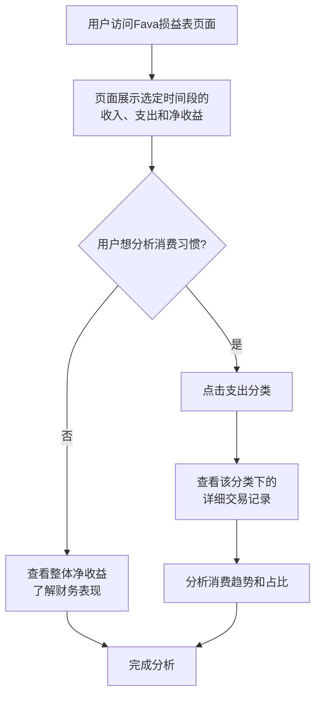
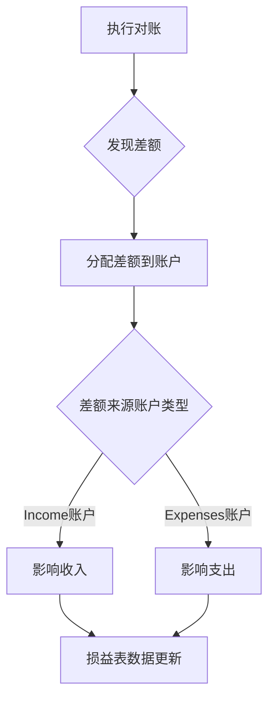

损益表是 Fava 报表工具中用于分析收入和支出的重要报表，它让您能够清晰地了解在一段时间内（如一个月、一个季度或一年），您赚了多少钱、花了多少钱，以及净收益是多少。对于想要分析消费习惯和收入来源的用户来说，这是最实用的报表。

## 一、什么是损益表？

您可以把它想象成一个**财务成绩单**，记录您在一段时间内的财务表现。

- **时间段**：显示的是某个时间段（如 2025 年 1 月）的财务表现
- **核心指标**：
  - **收入 (Income)**：您赚到的所有钱（工资、奖金、投资收益等）
  - **支出 (Expenses)**：您花掉的所有钱（餐饮、交通、购物等）
  - **净收益 (Net Income)**：收入减去支出，表示这段时间的财务盈余或亏损

**它和资产负债表的区别？**

- **损益表 (Income Statement)**：按**时间段**查看财务表现。" 我在 2025 年 1 月赚了多少钱，花了多少钱？"
- **资产负债表 (Balance Sheet)**：按**时间点**查看财务状况。" 我在 2026-01-21 这天有多少资产和负债？"

## 二、如何访问损益表？

1. 在 Beancount-Trans 平台中，进入 **「账本管理」 -> 「平台账本」**，系统会自动打开 Fava 界面
2. 在 Fava 左侧的导航栏中，找到并点击 **「Income Statement」**（损益表）选项
3. 默认显示的是本月的损益表，您可以通过顶部的时间选择器查看任意时间段的财务表现

您会立即看到一个按账户类型组织的收入和支出明细，接下来的分析流程如下图所示：

## 三、理解损益表的结构

损益表按照账户类型组织，清晰地展示了您的收入和支出：

### 1. 收入 (Income)

收入是您赚到的所有钱，包括：

- **主动收入**：工资、奖金、兼职收入等
- **被动收入**：投资收益、利息收入、租金收入等
- **其他收入**：退款、报销、转账收入等

### 2. 支出 (Expenses)

支出是您花掉的所有钱，按照分类组织：

- **餐饮**：早餐、午餐、晚餐、咖啡、零食等
- **交通**：出租车、地铁、公交、油费等
- **购物**：日用品、服装、电子产品等
- **娱乐**：电影、游戏、旅游等
- **其他**：医疗、教育、保险等

### 3. 净收益 (Net Income)

净收益 = 收入 - 支出

- **正数**：表示这段时间有盈余，财务状况良好
- **负数**：表示这段时间有亏损，支出大于收入

## 四、如何阅读损益表？

### 1. 选择时间段

在损益表页面顶部，您可以选择任意时间段（如一个月、一个季度或一年），查看该时间段的财务表现。

### 2. 查看分类明细

点击损益表中的任意分类（如 " 餐饮 "），可以查看该分类下的详细交易记录和金额分布。

### 3. 分析消费习惯

通过对比不同时间段的损益表，您可以：

- 了解哪些支出类别占比最大
- 发现消费趋势和变化
- 制定预算和消费计划

## 五、损益表与对账的关系

虽然损益表主要关注收入和支出，但对账功能也会影响损益表：

**对账对损益表的影响**：

- **调整收入**：如果差额来自收入账户（如忘记记录的奖金），会影响收入数据
- **调整支出**：如果差额来自支出账户（如忘记记录的消费），会影响支出数据
- **调整账户**：使用 `Expenses:Adjustment` 等调整账户处理无法追溯的差额

> **延伸阅读**：详细了解对账功能，请参考 [对账文档](https://trans.dhr2333.cn/docs/%E7%94%A8%E6%88%B7%E6%8C%87%E5%8D%97/reconciliation)

## 六、为什么损益表很重要？

- **了解消费习惯**：清楚地看到钱花在哪里，哪些支出占比最大
- **分析收入来源**：了解收入的主要来源，优化收入结构
- **制定预算**：基于历史数据制定合理的预算计划
- **财务规划**：通过净收益判断财务状况，制定财务目标

## 常见问题 (FAQ)

**Q1: 为什么我的净收益是负数？**

**A:** 净收益为负数表示这段时间的支出大于收入。这可能是正常的（如大额消费月份），但长期负数需要关注财务状况。

**Q2: 损益表中的数据准确吗？**

**A:** 损益表基于账本中的交易记录自动生成。建议定期对账，确保所有交易都已正确记录，这样损益表才会准确。

**Q3: 我可以修改损益表中的数据吗？**

**A:** 损益表是自动生成的，不能直接修改。如果需要调整，应该通过修改账本中的交易记录或使用对账功能来调整。

**Q4: 损益表多久更新一次？**

**A:** 实时更新。您在 Beancount-Trans 解析成功后的每一笔新交易，都会立即反映在损益表中。

**Q5: 如何通过损益表制定预算？**

**A:** 通过查看历史损益表，了解各支出类别的平均金额，然后根据这些数据制定下个月的预算计划。

---

**下一步：**

- **👉 [资产负债表](https://trans.dhr2333.cn/docs/%E8%B4%A2%E5%8A%A1%E6%8A%A5%E8%A1%A8/balance-sheet)**：了解如何查看资产、负债和净资产
- **👉 [对账功能](https://trans.dhr2333.cn/docs/%E7%94%A8%E6%88%B7%E6%8C%87%E5%8D%97/reconciliation)**：了解如何通过对账确保数据准确
- **👉 [日记账](https://trans.dhr2333.cn/docs/%E8%B4%A2%E5%8A%A1%E6%8A%A5%E8%A1%A8/journals)**：查看所有交易的原始记录
