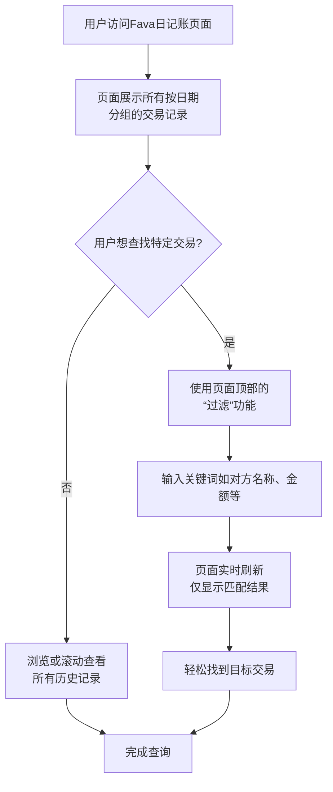

" 日记账 " 是 FAVA 报表工具中最基础也是最实用的功能之一，它让您能够按时间顺序查看所有交易的原始记录。对于想要核对消费、查找特定交易的用户来说，这是最常用、最直观的功能。

## 一、什么是日记账？

您可以把它想象成一个永远不会丢的、超级智能的**购物小票盒**。

- **时间顺序**：所有交易严格按照发生的时间先后顺序排列。
- **原始记录**：展示的是未经汇总的最原始数据，每一笔都清清楚楚。
- **可搜索**：您可以快速搜索任何关键词，找到想要的记录。


**它和分类账的区别？**

- **日记账 (Journals)**：按**时间**查看所有记录。" 我上周三都买了什么？"
- **分类账 (Ledger)**：按**账户**查看记录。" 我在吃饭上一共花了多少钱？"

## 二、如何访问日记账？

1. 在 Beancount-Trans 平台中，进入 **「账本管理」 -> 「平台账本」**，系统会自动打开 Fava 界面。
2. 在 Fava 左侧的导航栏中，找到并点击 **「Journals」** (日记账) 选项。

您会立即看到一个按日期分组的完整交易列表，接下来的查询流程如下图所示：



## 三、理解日记账的条目格式

日记账中的每一条记录都遵循标准格式，包含丰富的信息。以下面您提供的真实记录为例：

```txt
2025-01-06 * "西顿**店" "【预售】西顿照明奶油风白杯防眩筒灯嵌入式全光谱护眼客厅射灯" #DECORATION
    time: "20:43:30"
    uuid: "20250106300000118374561251487935"
    status: "ALiPay - 支付成功"
    Expenses:Home:Decoration                                               921.75 CNY
    Liabilities:CreditCard:Bank:CMB:C4523                                 -921.75 CNY
```

让我们分解这个例子中的每个部分：

- **日期 (Date)**：`2025-01-06` - 交易发生的具体日期。
- **元数据 (Metadata)**：
  - `time: "20:43:30"` - 交易发生的精确时间。
  - `uuid: "20250106300000118374561251487935"` - 交易的唯一标识符，可用于精准定位。
  - `status: "ALiPay - 支付成功"` - 交易状态和来源平台。
- **类型与描述**：
  - `*` - 代表已完成的交易。
  - `"西顿**店"` - 交易对方或商户名称（已自动脱敏处理）。
  - `"【预售】西顿照明奶油风白杯防眩筒灯嵌入式全光谱护眼客厅射灯"` - 商品或交易的详细描述。
  - `#DECORATION` - 自定义标签，可用于快速筛选所有家居装饰类消费。
- **科目与金额**：
  - `Expenses:Home:Decoration 921.75 CNY` ：**钱去了哪里**（支出科目，金额为正）。这笔钱被归类为 " 家庭: 装饰 " 支出。
  - `Liabilities:CreditCard:Bank:CMB:C4523 -921.75 CNY` ：**钱从哪来**（负债科目，金额为负）。这笔钱来自招商银行信用卡（尾号 C4523）。

## 四、如何快速查询交易？

日记账页面顶部提供了一个强大的 **" 过滤 " (Filter)** 输入框，这是您查找记录的利器。

### 常用搜索技巧

| 如果你想查找… | 在过滤框可以输入… | 示例 |
| :--- | :--- | :--- |
| **特定商家** | 商家名称（支持部分名称） | `西顿`、`麦当劳` |
| **特定商品** | 商品描述中的关键词 | `筒灯`、`咖啡`、`会员` |
| **特定金额** | 具体数字 | `921.75`、`38` |
| **特定标签** | 标签名称 | `#DECORATION` |
| **特定日期** | 年份或月份 | `2025-01`、`2025` |
| **特定账户** | 账户名称 | `Expenses:Home`、`Liabilities:CreditCard` |

**组合搜索**：您还可以组合多个关键词来缩小范围，例如搜索 `西顿 2025-01`，可以找出所有 2025 年 1 月与西顿相关的消费。

## 五、为什么日记账很重要？

- **对账核销**：轻松核对银行或支付宝的账单，确保没有错误或盗刷。
- **追踪消费**：快速找到任何一笔历史消费的详细信息，比如您买的那个筒灯的具体型号和价格。
- **理解记账**：通过查看原始记录，更好地理解复式记账的运作方式。
- **数据基础**：它是生成其他所有报表（如损益表、资产负债表）的数据基石。

## 常见问题 (FAQ)

**Q: 为什么我看到的记录和我的原始账单不太一样？**
**A:** 这是正常的。日记账显示的是经过 Beancount-Trans **解析、映射和丰富后**的记录，商户名称已被统一，分类已被标准化，并添加了标签等元数据，更加清晰统一，便于后续分析。

**Q: 我能修改日记账里的记录吗？**
**A:** 可以直接在 Fava 里修改，也可以在 FAVA 提供的编辑器里修改。但建议在 Beancount-Trans 平台通过**调整映射规则并重新解析账单**来完成。这才是 " 一劳永逸 " 的正确方法。

**Q: 日记账里的记录有延迟吗？**
**A:** 没有延迟。您在 Beancount-Trans 解析成功后的每一笔新交易，都会**实时**地出现在日记账中。

---

现在就去 **「平台账本」** 中打开 **「Journals」** 功能，亲自体验一下查询所有交易的便捷吧！您可以尝试搜索上面例子中的 `#DECORATION` 标签，看看能找到多少笔家居装饰相关的消费。
