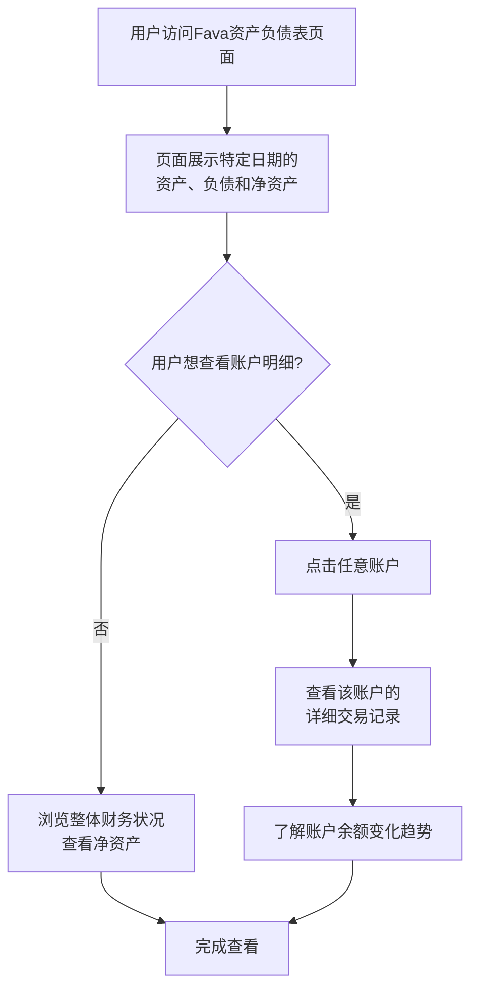
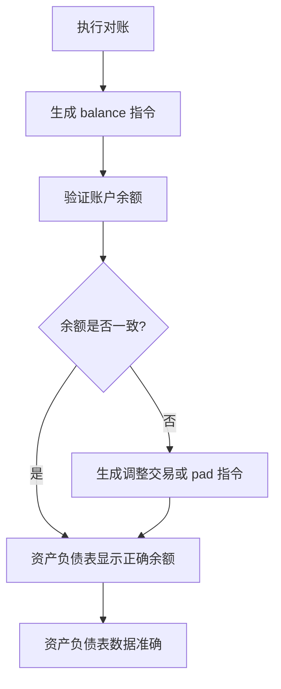

资产负债表是 Fava 报表工具中最核心的财务报表之一，它让您能够清晰地了解在某个特定时间点，您拥有多少资产、欠了多少债务，以及您的净资产是多少。对于想要全面掌握财务状况的用户来说，这是最重要的报表。

## 一、什么是资产负债表？

您可以把它想象成一个**财务快照**，就像给您的财务状况拍了一张照片。

- **时间点**：显示的是某个特定日期（如 2026-01-21）的财务状况
- **会计恒等式**：资产 = 负债 + 净资产（权益）
- **三大要素**：
  - **资产 (Assets)**：您拥有的所有有价值的东西（现金、银行存款、投资、房产等）
  - **负债 (Liabilities)**：您欠别人的钱（信用卡欠款、房贷、车贷等）
  - **净资产 (Equity)**：真正属于您的财富（资产减去负债）

**它和损益表的区别？**

- **资产负债表 (Balance Sheet)**：按**时间点**查看财务状况。" 我在 2026-01-21 这天有多少资产和负债？"
- **损益表 (Income Statement)**：按**时间段**查看财务表现。" 我在 2025 年 1 月赚了多少钱，花了多少钱？"

## 二、如何访问资产负债表？

1. 在 Beancount-Trans 平台中，进入 **「账本管理」 -> 「平台账本」**，系统会自动打开 Fava 界面
2. 在 Fava 左侧的导航栏中，找到并点击 **「Balance Sheet」**（资产负债表）选项
3. 默认显示的是今天的资产负债表，您可以通过顶部的时间选择器查看任意日期的财务状况

您会立即看到一个按账户类型组织的完整财务状况，接下来的查看流程如下图所示：

## 三、理解资产负债表的结构

资产负债表按照账户类型组织，清晰地展示了您的财务状况：

### 1. 资产 (Assets)

资产是您拥有的所有有价值的东西，包括：

- **流动资产**：现金、银行存款、支付宝余额、微信零钱等
- **投资资产**：股票、基金、债券等
- **固定资产**：房产、汽车等（可按金额入账并定期折旧）

### 2. 负债 (Liabilities)

负债是您欠别人的钱，包括：

- **信用卡欠款**：各银行信用卡的未还金额
- **贷款**：房贷、车贷、个人贷款等
- **其他负债**：预付款、应付账款等

### 3. 净资产 (Equity)

净资产 = 资产 - 负债，这是真正属于您的财富。

- **正数**：表示您的资产大于负债，财务状况良好
- **负数**：表示您的负债大于资产，需要关注财务状况

## 四、资产负债表与对账的关系

对账功能生成的 `balance` 指令会直接影响资产负债表：

**对账的重要性**：

- **确保准确性**：定期对账可以确保资产负债表显示的余额与实际账户余额一致
- **发现差异**：如果资产负债表显示的余额与实际不符，说明可能有遗漏的交易或错误
- **数据基础**：准确的资产负债表是进行财务分析和决策的基础

> **延伸阅读**：详细了解对账功能，请参考 [对账文档](https://trans.dhr2333.cn/docs/%E7%94%A8%E6%88%B7%E6%8C%87%E5%8D%97/reconciliation)

## 五、如何阅读资产负债表？

### 1. 查看特定日期的财务状况

在资产负债表页面顶部，您可以选择任意日期，查看该日期的财务状况。这对于了解财务状况的历史变化非常有用。

### 2. 点击账户查看明细

点击资产负债表中的任意账户，可以查看该账户的详细交易记录和余额变化趋势。

### 3. 理解账户层级

资产负债表按照账户层级组织，您可以展开或折叠账户，查看不同层级的汇总信息。

## 六、为什么资产负债表很重要？

- **全面了解财务状况**：一目了然地看到您的资产、负债和净资产
- **财务健康评估**：通过净资产判断您的财务状况是否健康
- **决策支持**：为投资、消费、借贷等财务决策提供数据支持
- **趋势分析**：通过对比不同日期的资产负债表，了解财务状况的变化趋势

## 常见问题 (FAQ)

**Q1: 为什么我的资产负债表显示负数？**

**A:** 如果净资产为负数，说明您的负债大于资产。这可能是正常的（如刚买房时），但也需要关注财务状况。建议定期对账，确保数据准确。

**Q2: 资产负债表中的余额和实际账户余额不一致怎么办？**

**A:** 这是对账功能要解决的问题。请参考 [对账文档](https://trans.dhr2333.cn/docs/%E7%94%A8%E6%88%B7%E6%8C%87%E5%8D%97/reconciliation)，定期对账可以确保数据一致。

**Q3: 我可以修改资产负债表中的数据吗？**

**A:** 资产负债表是自动生成的，不能直接修改。如果需要调整，应该通过修改账本中的交易记录或使用对账功能来调整。

**Q4: 资产负债表多久更新一次？**

**A:** 实时更新。您在 Beancount-Trans 解析成功后的每一笔新交易，都会立即反映在资产负债表中。

**Q5: 如何理解会计恒等式？**

**A:** 会计恒等式 " 资产 = 负债 + 净资产 " 是复式记账的基础。简单理解：您拥有的所有东西（资产）要么是借来的（负债），要么是真正属于您的（净资产）。

---

**下一步：**

- **👉 [对账功能](https://trans.dhr2333.cn/docs/%E7%94%A8%E6%88%B7%E6%8C%87%E5%8D%97/reconciliation)**：了解如何通过对账确保资产负债表数据准确
- **👉 [损益表](https://trans.dhr2333.cn/docs/%E8%B4%A2%E5%8A%A1%E6%8A%A5%E8%A1%A8/income-statement)**：了解如何分析收入和支出
- **👉 [日记账](https://trans.dhr2333.cn/docs/%E8%B4%A2%E5%8A%A1%E6%8A%A5%E8%A1%A8/journals)**：查看所有交易的原始记录
