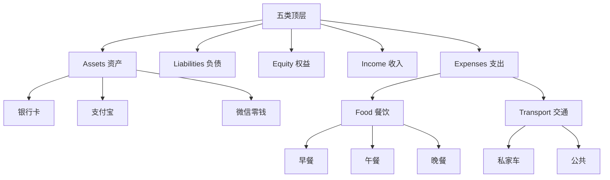

每当账单被解析成 Beancount 语句，平台都会问一句：「这一笔该放到哪个抽屉？」答案就是账户。理解账户不需要会计背景，更像是收纳：把散落的东西放回盒子，报表和分析才有条理。

## 一、作用与协作

在 Beancount-Trans 里，账户负责这几件事：

- **定义资金流向**：钱从哪里来、花到哪里去
- **结构化分类**：财务分类框架，也是损益表、资产负债表等报表的数据基础
- **预置模板**：注册时提供官方账户模板，覆盖常见场景
- **映射的落点**：当 [映射](../99-归档/03-映射.md) 规则命中交易时，写入对应账户，串起「账单 → 分析 → 报表」
- **与标签分工**：账户做基础分类；标签补充维度（如商务、报销），在 Fava 里可组合筛选

## 二、树状结构与命名

Beancount 顶层是 **Assets / Liabilities / Equity / Income / Expenses** 五类；下面用冒号 `:` 逐级细分。下图用「汇总节点」把五类画在一起，便于一眼看清层级关系（并非账本里存在一个名叫「根」的账户）。

**命名与维护：**

- 层级用冒号分隔，例如 `Expenses:Food:Breakfast` 表示「支出 → 餐饮 → 早餐」
- 路径中某段尚不存在时，平台可按需自动创建父级，减少手工搭建
- 重命名上层账户时，下级路径会联动更新，保持完整

## 三、生命周期（简述）

1. **创建**：新增路径时，系统会检查并补齐父级  
2. **活跃 / 禁用**：启用则接收映射写入；暂不用可禁用  
3. **归档**：已结束用途的账户（如已还清贷款）可禁用保留历史  
4. **删除**：需先把依赖该账户的映射迁走，再删除  

## 四、实践建议

> [!NOTE] 层次分明
> 优先保持 **2–3 层**。只有现有账户说不清「这笔钱为何而来 / 用往何处」时，再增加子账户。

- **先粗后细**：例如先有 `Expenses:Food`，数据多了再拆 `Breakfast`、`Dinner`  
- **常用渠道单独建户**：支付宝、微信零钱等可走独立资产子路径（如 `Assets:Alipay`），对账与统计更直观  
- **名称可读**：语义清楚，中英文尽量一致，方便自动化与外部工具  

## 五、常见问题（FAQ）

**Q1: 账户太多会不会乱？**

**A:** 原则见上文「层次分明」：**少层、够用再加**。层数一多，映射和报表都会变难维护。

**Q2: 已解析的交易想改用新账户？**

**A:** 一般先改映射再重新解析原账单；条数很少时也可在账本里直接改账户名。两种方式都能与最新账户体系统一。

**Q3: 账户和标签怎么搭配？**

**A:** 账户决定「放进哪个抽屉」；标签叠加上下文（商务、报销等）。组合使用后，Fava 筛选能回答更多问题。

**Q4: 能改系统预置账户吗？**

**A:** 可以，但不建议大改。有特殊需求时，更稳妥的是在现有结构下**新增**账户，以免影响推荐与模板一致性。

**Q5: 账户名能用中文吗？**

**A:** 最后一层支持，但建议英文或拼音：部分报表对中文支持不完整，英文也更利于与工具链协作。

---

**下一步**

- 进行 [定期对账](../02-操作指南/撤回对账与重做.md)
- 标签用法见 [标签](../99-归档/05-标签.md)
- 账户树在 Fava 中的展示可参考 [Fava 示例账本 - 试算表](https://fava.pythonanywhere.com/example-beancount-file/trial_balance/)
