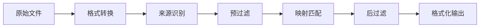

解析是平台的核心引擎：把您从支付宝、微信、银行导出的原始账单文件，变成标准的 Beancount 交易记录。理解引擎内部如何工作，能帮您判断结果为什么是这样、以及如何让它更准确。

## 一、数据管线：一份账单经历了什么

上传一份账单后，数据会依次经过以下阶段：

| 阶段        | 做了什么                                                                                                                            | 影响结果的因素            |
| :-------- | :------------------------------------------------------------------------------------------------------------------------------ | :----------------- |
| **格式转换**  | 将 CSV / Excel / PDF 统一转为指定格式的 UTF-8 文本；加密文件在此步解密                                                                                | 文件编码、是否加密          |
| **来源识别**  | 读取文件首行，自动判断账单来源（支付宝、微信、银行等）                                                                                                     | 文件必须是官方导出的原始格式     |
| **预过滤**   | 根据忽略策略剔除无效交易（退款、交易关闭等）                                                                                                          | 各来源的忽略规则           |
| **映射匹配**  | 逐条用 [映射](../99-归档/03-映射.md) 规则的关键字匹配交易对手方和商品描述，确定目标账户；多条规则冲突时由 AI 模型仲裁 | 映射规则的数量与精度、AI 模型选择 |
| **后过滤**   | 移除空记录等异常数据                                                                                                                      | —                  |
| **格式化输出** | 按格式化配置生成 Beancount 语句，附带 [标签](../99-归档/05-标签.md)、时间元数据等                    | 格式化配置选项            |

解析完成后，结果要么**直接写入账本文件**，要么**暂存等待审核**——取决于您选择的解析模式（见下文）。

## 二、支持的账单来源

系统通过文件首行自动识别来源，文件必须是**官方原始导出**，不能手动编辑或修改列结构。当前支持的来源及导出方法见 [账单文件导出说明](../02-操作指南/账单导出方法.md)。

> 作者仅维护支付宝、微信等常用格式，即使如此也可能因第三方更新导致解析异常。需要支持其他银行/平台？欢迎参与贡献，详见 [新增支持账单](../99-归档/04-新增支持账单.md)。

## 三、解析设置

在 **「解析设置」** 中可以调整两类配置，直接使用即可感受效果：

- **解析模式**：**审核模式**（默认）会暂存结果供逐条确认后写入，24 小时未审核自动写入；**直接写入模式**则解析后立即写入账本。两种模式的分类逻辑完全相同。
- **格式化输出**：控制 Beancount 语句中包含哪些元素——交易标志（`*` / `!`）、备注、标签、时间、UUID、原始状态、折扣/手续费行、默认货币，以及映射冲突时使用的 AI 仲裁模型（BERT / spaCy / DeepSeek）。

## 四、预过滤：哪些交易会被自动忽略

为避免无效交易干扰账本，系统会在解析前自动过滤以下状态的记录：

- **支付宝**：退款成功、交易关闭、解冻成功、还款失败、等待付款、芝麻免押下单成功等状态，以及余额宝收益发放类交易
- **微信支付**：已全额退款、对方已退还

被过滤的交易不会出现在解析结果中。如果您发现某条交易缺失，可以先检查其原始状态是否属于上述类别。

## 五、诊断与改善

| 现象           | 可能原因                     | 对策                                                                                             |
| :----------- | :----------------------- | :--------------------------------------------------------------------------------------------- |
| 交易分类不对       | 映射规则缺失或关键字不够精确           | 创建更具体的映射规则（见 [映射](https://trans.dhr2333.cn/docs/%E7%94%A8%E6%88%B7%E6%8C%87%E5%8D%97/mapping)） |
| 多条规则冲突、AI 选错 | 多个关键字同时匹配                | 调用云端模型或手动选择                                                                                    |
| 文件无法识别       | 账单不支持、被手动编辑、格式非官方导出、编码异常 | 重新从官方渠道导出，不要用 Excel 打开后另存                                                                      |

## 六、常见问题（FAQ）

**Q1: 重新上传同一个文件会重复吗？**

**A:** 系统不允许上传同名文件。如果以不同文件名重新上传并解析，会产生重复。此时可在平台账本中注释掉（行首加 `;`）重复文件的 `include` 语句来隐藏。

**Q2: 映射规则更新后旧结果会自动变更吗？**

**A:** 不会。映射规则在**解析时**应用。更新规则后需要重新解析原账单文件，新规则才会生效。

**Q3: AI 候选分类是怎么来的？**

**A:** 当多条映射规则的优先级相同时，系统使用格式化配置中指定的 AI 模型，对交易文本与各候选账户进行语义相似度计算，按分数排序展示。

**Q4: 加密的账单文件怎么处理？**

**A:** 上传时提供密码即可，系统会在格式转换阶段自动解密。解密失败会提示具体原因。

---

- **👉 [前往「解析」页面](https://trans.dhr2333.cn/trans)**：亲自上传一份账单体验一下！
- **👉 [学习映射管理](../99-归档/03-映射.md)**：了解如何创建和管理规则，让解析结果更准确。
- **👉 [查看忽略策略](../99-归档/09-忽略.md)**：了解哪些交易会被自动过滤。
